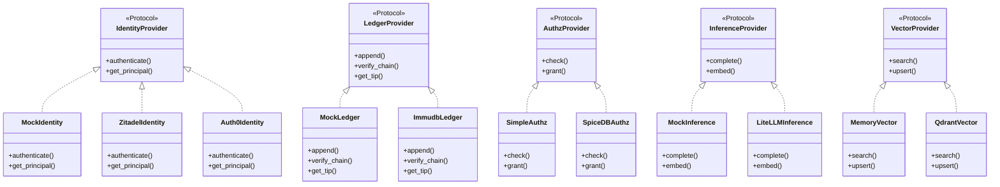
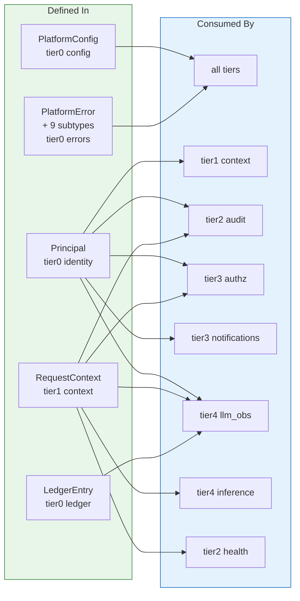
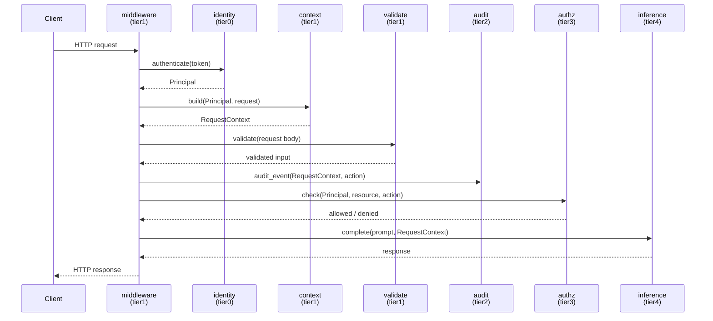
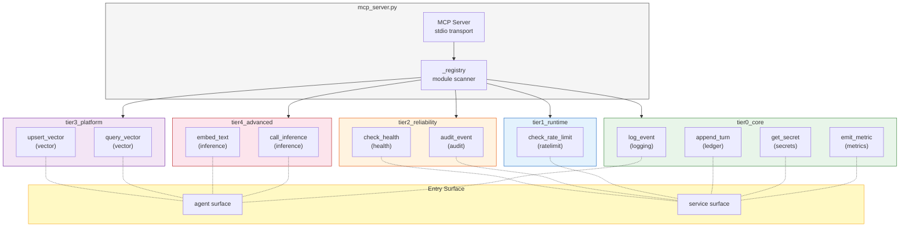
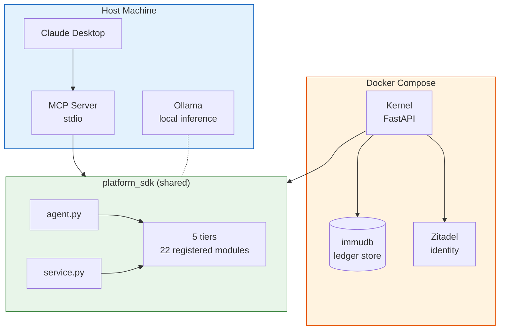

# Platform SDK Architecture Diagrams

> Visual reference for the DoPeJar platform SDK (46 modules, 5 tiers) and MCP server.

---

## 1. Tier Architecture

The SDK is a strict 5-tier layer cake. Each tier may only import from tiers below it.

```mermaid
flowchart TB
    subgraph tier0["tier0_core (8 modules)"]
        direction LR
        identity[identity]
        logging[logging]
        errors[errors]
        config[config]
        secrets[secrets]
        data[data]
        metrics[metrics]
        ledger[ledger]
    end

    subgraph tier1["tier1_runtime (6 modules)"]
        direction LR
        context[context]
        validate[validate]
        serialize[serialize]
        retry[retry]
        ratelimit[ratelimit]
        middleware[middleware]
    end

    subgraph tier2["tier2_reliability (3 modules)"]
        direction LR
        health[health]
        audit[audit]
        cache[cache]
    end

    subgraph tier3["tier3_platform (3 modules)"]
        direction LR
        authorization[authorization]
        notifications[notifications]
        vector[vector]
    end

    subgraph tier4["tier4_advanced (2 modules)"]
        direction LR
        inference[inference]
        llm_obs[llm_obs]
    end

    tier4 --> tier3
    tier3 --> tier2
    tier2 --> tier1
    tier1 --> tier0

    style tier0 fill:#e8f5e9,stroke:#2e7d32
    style tier1 fill:#e3f2fd,stroke:#1565c0
    style tier2 fill:#fff3e0,stroke:#e65100
    style tier3 fill:#f3e5f5,stroke:#6a1b9a
    style tier4 fill:#fce4ec,stroke:#b71c1c
```

**Takeaway**: Imports flow strictly downward. A tier2 module can use tier1 and tier0, never tier3 or tier4.

---

## 2. Entry Surfaces

Two public APIs gate access to the SDK: a narrow agent surface and a wide service surface.

```mermaid
flowchart LR
    subgraph agent["agent.py (12 exports)"]
        direction TB
        a1[complete]
        a2[embed]
        a3[Message]
        a4[observe]
        a5[get_llm_tracer]
        a6[record_inference]
        a7[vector_search]
        a8[vector_upsert]
        a9[vector_delete]
        a10[get_logger]
        a11[PlatformError]
        a12[RateLimitError<br/>UpstreamError]
    end

    subgraph service["service.py (~40 exports)"]
        direction TB
        s1[everything in agent.py]
        s2[identity / config / secrets]
        s3[data / ledger / metrics]
        s4[context / validate / serialize]
        s5[retry / ratelimit / middleware]
        s6[health / audit / cache]
        s7[authz / notifications]
    end

    agent -- "subset of" --> service

    subgraph consumers["Consumers"]
        ai[AI Agents]
        be[Backend Services]
    end

    ai --> agent
    be --> service

    style agent fill:#e3f2fd,stroke:#1565c0
    style service fill:#fff3e0,stroke:#e65100
```

**Takeaway**: Agents get 12 safe symbols. Services get the full SDK. The agent boundary is intentional — it limits what AI can reach.

---

## 3. Provider Protocol Pattern

Five provider families follow the same pattern: a Protocol defines the interface, concrete implementations fulfill it, and an env var selects which one runs.

| Protocol | Env Var | Default |
|----------|---------|---------|
| IdentityProvider | `PLATFORM_IDENTITY_PROVIDER` | Mock |
| LedgerProvider | `PLATFORM_LEDGER_BACKEND` | Mock |
| AuthzProvider | `PLATFORM_AUTHZ_BACKEND` | Simple |
| InferenceProvider | `PLATFORM_INFERENCE_PROVIDER` | Mock |
| VectorProvider | `PLATFORM_VECTOR_BACKEND` | Memory |

**Takeaway**: Every external dependency is behind a Protocol. Mock implementations exist for every provider, enabling full offline testing.

---

## 4. Shared Interfaces

Four types cross tier boundaries. They are defined low and consumed high.

**Takeaway**: `PlatformConfig` and `PlatformError` are universal. `Principal` and `RequestContext` thread identity and request state upward through the tiers.

---

## 5. Request Flow

An HTTP request through the full middleware stack, showing how each tier contributes.

**Takeaway**: Identity establishes who. Context captures what. Validate checks input. Audit records the action. Authz gates access. Inference does the work.

---

## 6. MCP Server Tools

The MCP server discovers tools at startup via `__sdk_export__["mcp_tools"]` in each module.

**Takeaway**: 11 tools across 8 modules. 5 tools on the agent surface, 6 on the service surface. The MCP server uses stdio transport and discovers tools from `__sdk_export__` metadata.

---

## 7. Runtime Topology

How the SDK sits in the deployed system: shared by the host and Docker containers.

**Takeaway**: The platform SDK is the shared layer. Claude Desktop reaches it via MCP. The kernel reaches it directly. Docker provides the stateful backends (immudb for ledger, Zitadel for identity).
