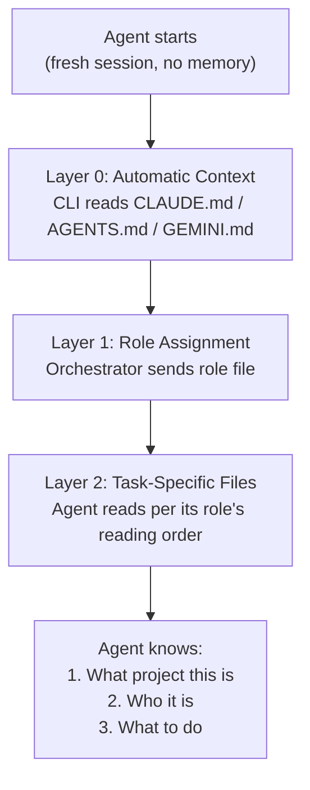
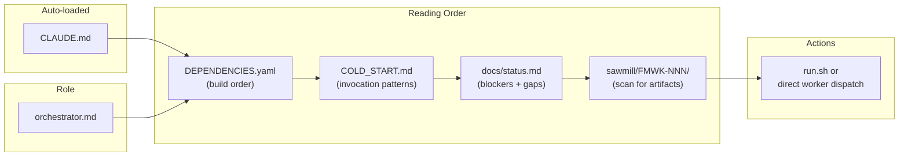
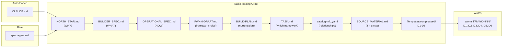
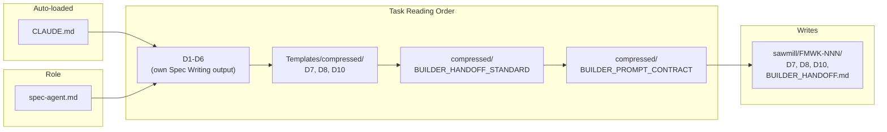
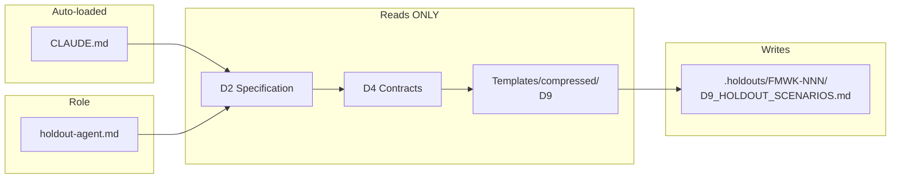
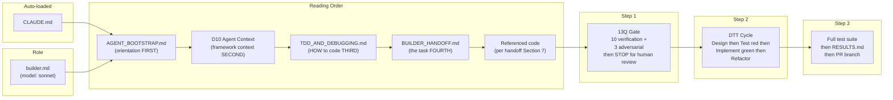
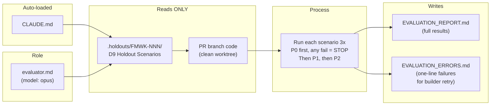
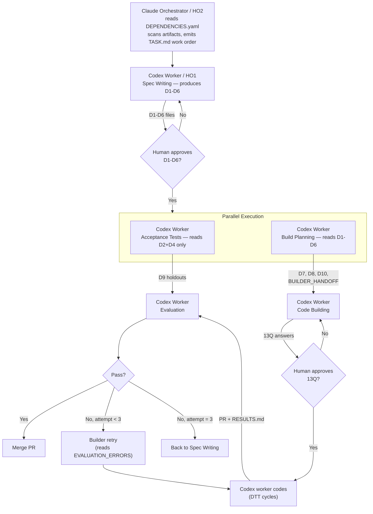

# How Agents Boot and Find Their Role

Every agent in the Sawmill pipeline starts from zero — no memory of prior turns, no shared state. The filesystem is the message bus. This page explains exactly how an agent goes from "I exist" to "I know what to do."

Current execution contract: Claude is the orchestrator, and Codex is the default worker backend for Turns A-E.

---

## The Three-Layer Boot Sequence

Every agent, regardless of role, follows this same boot path:



### Layer 0 — Automatic Context (happens without being told)

Each CLI tool reads its own context file on startup. The content is identical — they're all symlinks to the same file:

| CLI Tool | Auto-reads | How |
|----------|-----------|-----|
| Claude Code | `CLAUDE.md` | Built-in, automatic |
| Codex CLI | `AGENTS.md` | Symlink to CLAUDE.md |
| Gemini CLI | `GEMINI.md` | Symlink to CLAUDE.md |

**After Layer 0, the agent knows:** project identity, drift warning, nine primitives, core invariant, 6 KERNEL frameworks, Sawmill overview, isolation rules, repo structure, naming conventions.

### Layer 1 — Role Assignment (orchestrator tells the agent who it is)

The orchestrator sends the agent's role file content in the prompt. Role files live in `.claude/agents/`:

| Role File | Assigned During |
|-----------|----------------|
| `orchestrator.md` | Pipeline Management |
| `spec-agent.md` | Spec Writing and Build Planning |
| `holdout-agent.md` | Acceptance Test Writing |
| `builder.md` | Code Building |
| `evaluator.md` | Evaluation |
| `auditor.md` | Portal Coherence Audit |

**After Layer 1, the agent knows:** its role, what it can and cannot read, its process steps, its gate requirements, and its reading order for the next layer.

### Layer 2 — Task-Specific Files (agent reads per its role)

Each role reads a different set of files. The role file lists them explicitly. See the per-role sections below.

All non-orchestrator roles below are worker roles. Claude dispatches and supervises them; Codex executes them by default.

---

## Per-Role Boot Paths

### Orchestrator — Pipeline Manager

The orchestrator is HO2 and is dispatch-only. It determines the next eligible framework and turn, emits a work order, invokes the owning agent, waits for gates and results, and tracks status.



**Can:** Emit dispatch/work-order artifacts (`TASK.md` or inline `WORK_ORDER`), invoke `run.sh`, dispatch Codex workers directly, wait for gates, report `STATUS` / `VERDICT`.

**Cannot:** Skip gates, modify holdouts, make architectural decisions, fix specs/code/evaluations directly, create standalone plans beyond dispatch artifacts, run frameworks in parallel.

---

### Spec Agent — Spec Writing

Reads architecture documents, extracts specifications into D1-D6.



**Gate:** D6 must have zero OPEN items. Human approves.

**Key rules:**
- Extract from docs — never invent
- Unclear boundaries go to D6, not into a guess
- Self-checks after D2, D4, and D6

---

### Spec Agent — Build Planning

Same agent, different turn. Translates approved D1-D6 into build plans.



**Gate:** Constitution Check covers all D1 articles. Every D2 P1 scenario has a task.

---

### Holdout Agent — Acceptance Test Writing

Writes test scenarios the builder will never see. Runs in parallel with Build Planning.



**Strict isolation — CANNOT read:** D1, D3, D5, D6, D7, D8, D10, architecture files, staging code, builder output.

**Gate:** Coverage matrix covers all P0 and P1 scenarios. Minimum 3 scenarios. Human reviews for strength.

**Key rules:**
- Test BEHAVIOR (what callers observe), not implementation
- Must verify response SHAPE per D4 contracts, not just "did it error?"
- Each scenario: Setup, Execute, Verify (exit codes), Cleanup

---

### Builder — Code Building

Implements code from specifications. Uses sonnet model for fast coding.



**Strict isolation — CANNOT read:** `.holdouts/`, `EVALUATION_REPORT.md`, other builders' work.

**On retry (attempt 2+):** Reads `EVALUATION_ERRORS.md` first. Fixes only what failed. Does NOT re-answer 13Q. Max 3 attempts.

**Gate:** 13Q answers approved by human. All tests pass.

**Key rules:**
- NO code before failing test (TDD Iron Law)
- Commit after every green cycle
- Mid-build checkpoint after unit tests (report status, wait for human greenlight)
- Self-reflection before reporting complete

---

### Evaluator — Evaluation

Runs holdout scenarios against built code. Uses opus model for deep reasoning about correctness.



**Strict isolation — CANNOT read:** D1-D8, D10, BUILDER_HANDOFF, RESULTS.md, builder reasoning, architecture docs.

**Gate:** All P0 pass. All P1 pass. 90% overall. No partial credit.

**Verdict logic:**
- Scenario passes if 2 of 3 runs pass
- PASS only if all P0 pass AND all P1 pass AND overall >= 90%
- On failure: one-line error per scenario (WHAT failed, not WHY or how to fix)

---

## Who Can See What

This matrix is the enforcement boundary. Violations break the pipeline's integrity.

| File | Orchestrator | Spec Writing | Build Planning | Acceptance Tests | Code Building | Evaluation |
|------|:---:|:---:|:---:|:---:|:---:|:---:|
| Context file (CLAUDE.md) | auto | auto | auto | auto | auto | auto |
| DEPENDENCIES.yaml | read | - | - | - | - | - |
| architecture/* | read | read | - | - | - | - |
| Templates/compressed/* | - | read | read | read | - | - |
| TASK.md | **write** | read | - | - | - | - |
| D1-D6 | read | **write** | read | D2+D4 only | - | - |
| D7, D8, D10 | read | - | **write** | - | read | - |
| BUILDER_HANDOFF | read | - | **write** | - | read | - |
| D9 (holdouts) | NEVER | - | - | **write** | NEVER | read |
| staging/ code | - | - | - | - | **write** | read (PR) |
| RESULTS.md | read | - | - | - | **write** | NEVER |
| EVALUATION_REPORT | read | - | - | - | NEVER | **write** |
| EVALUATION_ERRORS | read | - | - | - | read (retry) | **write** |
| docs/status.md | read | - | - | - | - | - |

---

## How the Orchestrator Invokes Agents

The orchestrator reads `sawmill/DEPENDENCIES.yaml` to determine build order, scans framework directories for artifact presence to derive state, emits a `WORK_ORDER`, and invokes agents via `run.sh` or direct CLI calls. When blockers exist, it dispatches the owning agent with the blocker context. It does NOT interpret specs, fix D2/D4/D8 directly, or make architectural decisions.

In the current system, Claude performs this orchestration work and Codex is the default worker backend for each dispatched turn.

### Claude Code
```bash
claude -p "<prompt>" \
  --allowedTools "Read,Edit,Write,Glob,Grep,Bash" \
  --append-system-prompt "$(cat .claude/agents/<role>.md)"
```

### Codex CLI
```bash
codex exec --full-auto \
  "$(cat AGENTS.md)
$(cat .claude/agents/<role>.md)
<task prompt>"
```

### Gemini CLI
```bash
gemini -p "<prompt with role file and task>" \
  --yolo --output-format json
```

---

## The Handoff Flow (Complete Picture)



---

## Quick Reference

| Question | Answer |
|----------|--------|
| Where do agents get project context? | The active CLI auto-loads its project context file: `CLAUDE.md`, `AGENTS.md`, or `GEMINI.md` |
| Where are role definitions? | `.claude/agents/<role>.md` |
| Where is the orchestrator role? | `.claude/agents/orchestrator.md` |
| Where is the dependency graph? | `sawmill/DEPENDENCIES.yaml` |
| Where do agents read templates? | `Templates/compressed/` (not `Templates/`) |
| Where does the builder write code? | `staging/<FMWK-ID>/` |
| Where do holdouts live? | `.holdouts/<FMWK-ID>/` (builder NEVER sees this) |
| Where are build results? | `sawmill/<FMWK-ID>/` |
| What executes the builder turn? | Codex worker by default, routed and supervised by Claude |
| What executes the evaluator turn? | Codex worker by default, routed and supervised by Claude |
| Max retry attempts? | 3, then back to spec writing |
| What's the pass threshold? | 2/3 per scenario, 90% overall, all P0+P1 must pass |
| How do I run an audit? | `./sawmill/run.sh --audit` or `SAWMILL_AUDIT_AGENT=codex ./sawmill/run.sh --audit` |
