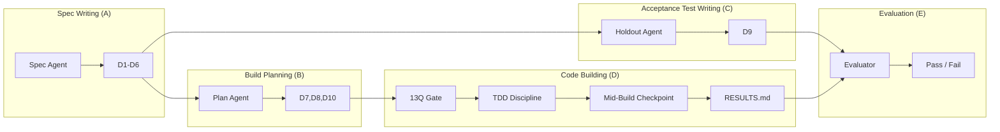
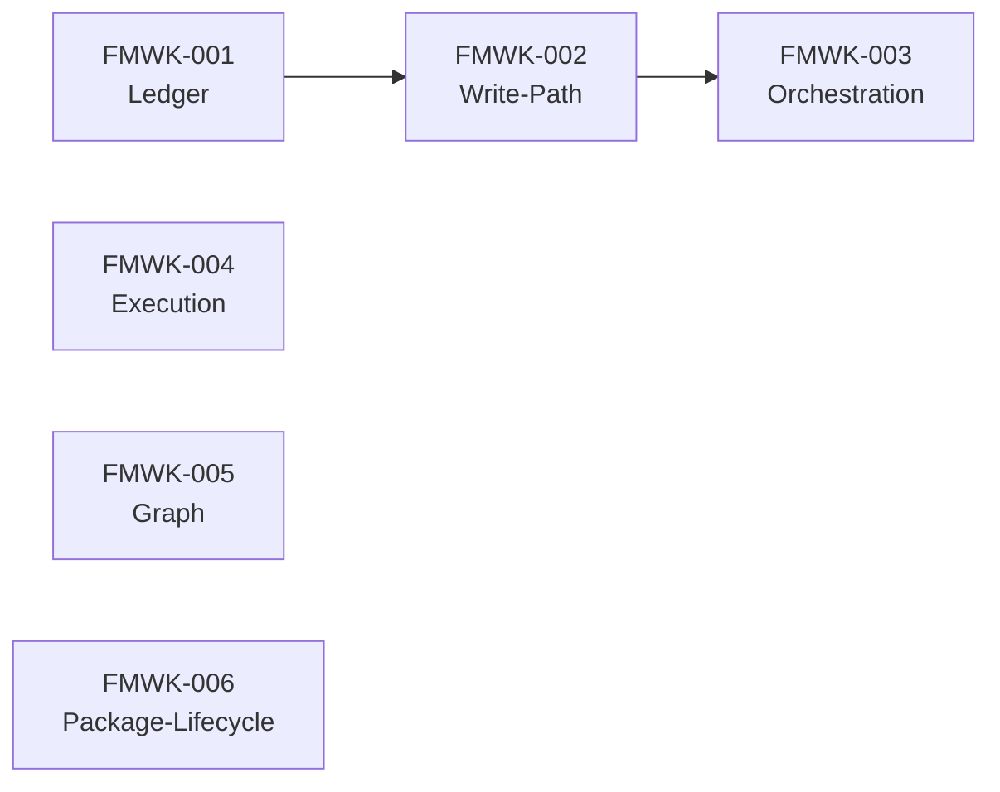
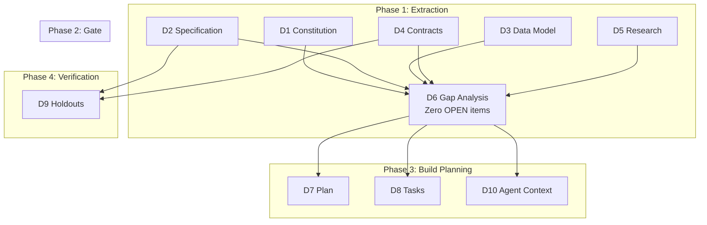
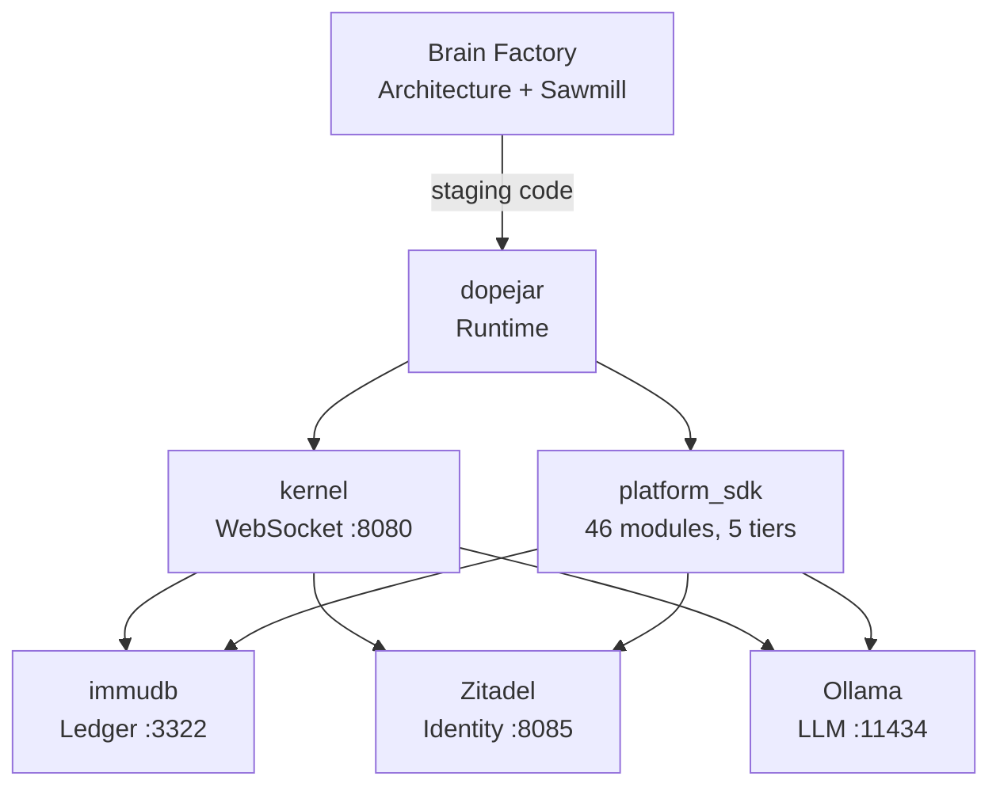

# Brain Factory

**DoPeJar** is a personal AI companion that remembers you — can't forget, can't drift.
**DoPeJarMo** is the governed OS that hosts it. **Brain Factory** is where it all gets designed and built.

---

## Where We Are

FMWK-001 Ledger has been fully specified (Spec Writing, Build Planning, and Acceptance Tests all complete). **Next step: fix 6 open issues, then start Code Building.** See full details on the [Status and Gaps](status.md) page.

| What | Status |
|------|--------|
| Architecture docs (NORTH_STAR, BUILDER_SPEC, OPERATIONAL_SPEC) | Done (all v3.0) |
| Sawmill pipeline (agents, templates, isolation) | Done |
| FMWK-001 Ledger specs (D1-D10) | Done — [view build page](sawmill/FMWK-001-ledger.md) |
| FMWK-001 open issues (3 contradictions, 3 missing) | **Fix now** |
| FMWK-001 Code Building | **Up next** — 12 tasks, 53 tests |
| FMWK-002 through 006 | Waiting — specs not started |

**[Full status, gaps, questions, and timeline →](status.md)**

---

## How Things Get Built

Every component goes through the **Sawmill pipeline** — a 5-turn process that takes architecture docs and produces tested, verified code. No guessing, no drift.

**Key isolation rule:** The builder never sees the acceptance tests (D9). The evaluator never sees the specs. This is how we prevent agents from gaming the process.

| I want to... | Go here |
|--------------|---------|
| Understand the full pipeline | [Pipeline Visual](sawmill/PIPELINE_VISUAL.md) |
| See what each agent does | [Agent Roles](#agent-roles) (below) |
| Use the D1-D10 templates | [Template Guide](sawmill-templates/GUIDE.md) |
| Start a new component spec | [Cold Start Protocol](sawmill/COLD_START.md) |

---

## What We're Building

Six KERNEL frameworks, built in order. Each one goes through the full Sawmill pipeline.

| Framework | What it does | Status |
|-----------|-------------|--------|
| [**FMWK-001 Ledger**](sawmill/FMWK-001-ledger.md) | Append-only hash-chained event store | Spec Writing (A) through Acceptance Test Writing (C) complete, Code Building (D) next |
| [**FMWK-002 Write-Path**](sawmill/FMWK-002-write-path.md) | Synchronous mutation, fold logic, snapshot | Waiting on FMWK-001 |
| [**FMWK-003 Orchestration**](sawmill/FMWK-003-orchestration.md) | Work order planning, dispatch, context | Waiting on FMWK-002 |
| [**FMWK-004 Execution**](sawmill/FMWK-004-execution.md) | LLM calls, prompt contract enforcement | Parallel with FMWK-003 |
| [**FMWK-005 Graph**](sawmill/FMWK-005-graph.md) | In-memory directed graph, query interface | Parallel with FMWK-003 |
| [**FMWK-006 Package-Lifecycle**](sawmill/FMWK-006-package-lifecycle.md) | Gates, install/uninstall, composition | Parallel with FMWK-003 |

For full build plan details: [BUILD-PLAN](architecture/BUILD-PLAN.md)

---

## Architecture — Why, What, How

Three documents form the authority chain. When anything is ambiguous, walk UP this list.

| Level | Document | One-line summary |
|-------|----------|-----------------|
| **WHY** | [NORTH STAR](architecture/NORTH_STAR.md) | Design authority. Resolves all ambiguity. Read this first if you're lost. |
| **WHAT** | [BUILDER SPEC](architecture/BUILDER_SPEC.md) | Nine primitives, Write Path, dispatch sequence, boot order. |
| **HOW** | [OPERATIONAL SPEC](architecture/OPERATIONAL_SPEC.md) | Docker topology, boot sequence, failure recovery, session transport. |

Supporting documents:

| Document | What it covers |
|----------|---------------|
| [Agent Constraints](architecture/AGENT_CONSTRAINTS.md) | How agents stay on track — boundaries, attempt limits, isolation rules |
| [FWK-0 Draft](architecture/FWK-0-DRAFT.md) | The framework that defines all other frameworks |
| [Sawmill Analysis](architecture/SAWMILL_ANALYSIS.md) | Why L3 dark factory, how the turns were designed |
| [Framework Registry](architecture/FRAMEWORK_REGISTRY.md) | All 6 KERNEL frameworks — IDs, owners, boundaries |

---

## Agent Roles

Four specialist agents, each scoped to one step. They cannot see each other's work.

| Agent | Step | What it does | Model |
|-------|------|-------------|-------|
| [Spec Agent](agents/spec-agent.md) | Spec Writing (A) + Build Planning (B) | Extracts D1-D6 from architecture docs, then builds D7-D8-D10 | — |
| [Holdout Agent](agents/holdout-agent.md) | Acceptance Test Writing (C) | Writes acceptance tests the builder never sees (D9) | — |
| [Builder](agents/builder.md) | Code Building (D) | Implements code from specs. 13Q gate, then TDD. | sonnet |
| [Evaluator](agents/evaluator.md) | Evaluation (E) | Runs holdout scenarios against built code. PASS/FAIL. | opus |

---

## Templates — The D1-D10 System

Ten documents that progressively specify a component from "why it exists" to "how to test it."

| Template | Purpose | Link |
|----------|---------|------|
| D1 — Constitution | Immutable rules, boundaries | [Template](sawmill-templates/D1_CONSTITUTION.md) |
| D2 — Specification | GIVEN/WHEN/THEN scenarios | [Template](sawmill-templates/D2_SPECIFICATION.md) |
| D3 — Data Model | Entity schemas, relationships | [Template](sawmill-templates/D3_DATA_MODEL.md) |
| D4 — Contracts | Interface boundaries, error contracts | [Template](sawmill-templates/D4_CONTRACTS.md) |
| D5 — Research | Design decisions, prior art | [Template](sawmill-templates/D5_RESEARCH.md) |
| D6 — Gap Analysis | What's missing (GATE: zero OPEN) | [Template](sawmill-templates/D6_GAP_ANALYSIS.md) |
| D7 — Plan | Architecture, components, files | [Template](sawmill-templates/D7_PLAN.md) |
| D8 — Tasks | Phased work items, acceptance criteria | [Template](sawmill-templates/D8_TASKS.md) |
| D9 — Holdout Scenarios | Acceptance tests (hidden from builder) | [Template](sawmill-templates/D9_HOLDOUT_SCENARIOS.md) |
| D10 — Agent Context | Builder's handbook | [Template](sawmill-templates/D10_AGENT_CONTEXT.md) |

**Supporting standards:**

| Document | What it defines |
|----------|----------------|
| [Template Guide](sawmill-templates/GUIDE.md) | How to fill out D1-D10, step by step |
| [Builder Handoff Standard](sawmill-templates/BUILDER_HANDOFF_STANDARD.md) | 13-section handoff format, results template, reviewer checklist |
| [TDD and Debugging](sawmill-templates/TDD_AND_DEBUGGING.md) | How builders code — TDD iron law, debugging protocol, commit discipline |
| [Builder Prompt Contract](sawmill-templates/BUILDER_PROMPT_CONTRACT.md) | Agent prompt template, 13Q gate, adversarial checks |
| [Build Process (YAML)](sawmill-templates/AGENT_BUILD_PROCESS.yaml) | Machine-readable workflow for orchestrators |

---

## System Topology

| Service | Port | Purpose |
|---------|------|---------|
| kernel | 8080 | WebSocket server — `/operator`, `/user`, `/health` |
| immudb | 3322 | Append-only hash-chained truth store |
| Zitadel | 8085 | OIDC identity, JWT, authorization |
| Ollama | 11434 | Local LLM (Metal GPU) |
| Backstage | 3000 | This — service catalog, TechDocs |

Full catalog details: [DoPeJarMo Catalog](dopejar-catalog.md)

---

## Quick Reference

### Where do I find...?

| Thing | Location |
|-------|----------|
| Architecture docs | `architecture/` in this repo |
| Sawmill templates | `Templates/` (human), `Templates/compressed/` (agent) |
| Agent definitions | `.claude/agents/` |
| Build output (code) | `staging/<FMWK-ID>/` |
| Sawmill working files | `sawmill/<FMWK-ID>/` |
| Holdout scenarios | `.holdouts/<FMWK-ID>/` (builder cannot see these) |
| Platform SDK | `/Users/raymondbruni/dopejar/platform_sdk/` |
| Docker services | `/Users/raymondbruni/dopejar/docker-compose.yml` |

### The Nine Primitives

| # | Primitive | One-liner |
|---|-----------|-----------|
| 1 | Ledger | Append-only hash-chained event store |
| 2 | Signal Accumulator | Methylation values (0.0-1.0) on Graph nodes |
| 3 | HO1 (Execution) | All LLM calls, stateless, sole Write Path entry |
| 4 | HO2 (Orchestration) | Mechanical only, NO LLM, reads Graph, plans work |
| 5 | HO3 (Graph) | In-memory materialized view, pure storage |
| 6 | Work Order | Atom of dispatched work |
| 7 | Prompt Contract | Governed LLM interaction template |
| 8 | Package Lifecycle | Staging > gates > filesystem |
| 9 | Framework Hierarchy | Framework > Spec Pack > Pack > File |

### Compression Standard

Agents read `Templates/compressed/` — same content, ~73% fewer tokens. When a full template changes, re-compress per [Compression Standard](compressed/COMPRESSION_STANDARD.md).
