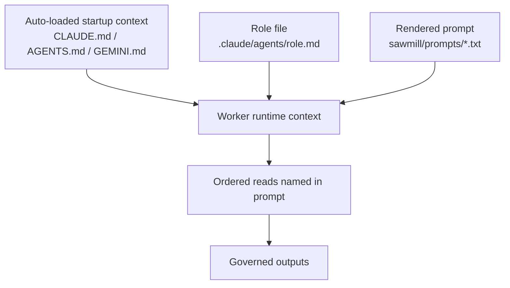

# Sawmill Agent Traversal Map

**Status**: OPERATIONAL REFERENCE
**Authority label**: narrative
**Date**: 2026-03-10

## Purpose

This page explains the exact file and runtime traversal path agents follow when
they use the Sawmill.

It is not a new source of truth. If this page disagrees with:

- `CLAUDE.md`
- `.claude/agents/*.md`
- `sawmill/EXECUTION_CONTRACT.md`
- `sawmill/run.sh`
- the Sawmill registries

those files win.

## One-Sentence Rule

Agents do not wander the repo randomly. The path is:

```text
auto-loaded startup context -> role file -> run.sh -> registries -> prompt template -> ordered file reads
```

## High-Level Traversal

```mermaid
flowchart LR
    H[Human prompt] --> C[Claude session]
    C --> S[CLI auto-loads startup context<br/>CLAUDE.md / AGENTS.md / GEMINI.md]
    S --> R[Role assignment<br/>.claude/agents/orchestrator.md]
    R --> X[Orchestrator reads runtime truth<br/>EXECUTION_CONTRACT + ROLE_REGISTRY + COLD_START]
    X --> RUN[./sawmill/run.sh]
    RUN --> REG[ROLE_REGISTRY + PROMPT_REGISTRY + ARTIFACT_REGISTRY]
    REG --> DISP[Resolve backend + role file + prompt file]
    DISP --> W[Worker backend starts]
    W --> WC[Worker gets startup context<br/>+ role file + rendered prompt]
    WC --> READ[Prompt tells worker exactly what to read next]
    READ --> OUT[Worker writes governed artifacts]
```



## What Loads First

### Startup context

The CLI loads one startup file automatically before any task-specific prompt:

| Backend | Auto-loaded file |
|--------|-------------------|
| Claude | `CLAUDE.md` |
| Codex | `AGENTS.md` → symlink to `CLAUDE.md` |
| Gemini | `GEMINI.md` → symlink to `CLAUDE.md` |

This startup context gives the agent:

- repo identity
- drift warning
- authority chain
- Sawmill overview
- execution model summary
- isolation and repo layout rules

### Role assignment

After startup context, the agent is pointed to a role file in:

- `.claude/agents/`

For example:

- orchestrator → `.claude/agents/orchestrator.md`
- spec worker → `.claude/agents/spec-agent.md`
- builder → `.claude/agents/builder.md`

## What the Orchestrator Reads

When Claude is told to act as the Sawmill orchestrator, the orchestrator role
defines the next reading chain:

1. `sawmill/DEPENDENCIES.yaml`
2. `sawmill/EXECUTION_CONTRACT.md`
3. `sawmill/ROLE_REGISTRY.yaml`
4. `sawmill/COLD_START.md`
5. `docs/status.md`
6. the target framework directory under `sawmill/<FMWK-ID>/`

Then the orchestrator runs:

```bash
./sawmill/run.sh <FMWK-ID>
```

That is the canonical dispatch path.

## What `run.sh` Does Next

`run.sh` is the runtime authority. At preflight it loads:

- `sawmill/ROLE_REGISTRY.yaml`
- `sawmill/ARTIFACT_REGISTRY.yaml`
- `sawmill/PROMPT_REGISTRY.yaml`

Those registries determine:

- which backend each role uses
- which role owns each prompt
- which artifacts are required and expected
- what freshness policy applies

Then `run.sh` dispatches each stage by combining:

- backend
- role file
- rendered prompt

## Worker Prompt Composition



This is the important point:

- startup context gives project-wide rules
- role file gives role-specific constraints
- rendered prompt gives the exact file reading order for that stage

## Why `AGENT_BOOTSTRAP.md` Appears First for Workers

`AGENT_BOOTSTRAP.md` is not globally auto-loaded by the CLI.

It becomes first in the worker reading chain because the prompt template says so.

Examples:

- Turn A prompt tells the spec worker to read `AGENT_BOOTSTRAP.md` first
- Turn D 13Q prompt tells the builder to read `AGENT_BOOTSTRAP.md` first

So the rule is:

- startup context loads automatically
- `AGENT_BOOTSTRAP.md` is then required by the rendered worker prompt

## Stage-Specific Reading Direction

### Turn A — Spec

The prompt directs the spec worker to read:

1. `AGENT_BOOTSTRAP.md`
2. `architecture/NORTH_STAR.md`
3. `architecture/BUILDER_SPEC.md`
4. `architecture/OPERATIONAL_SPEC.md`
5. `architecture/FWK-0-DRAFT.md`
6. `architecture/BUILD-PLAN.md`
7. `sawmill/<FMWK-ID>/TASK.md`
8. optional `SOURCE_MATERIAL.md`
9. compressed output templates

### Turn D — Builder 13Q

The prompt directs the builder to read:

1. `AGENT_BOOTSTRAP.md`
2. `D10_AGENT_CONTEXT.md`
3. `Templates/TDD_AND_DEBUGGING.md`
4. `BUILDER_HANDOFF.md`
5. referenced code from the handoff

The builder is also explicitly told not to read `.holdouts/`.

### Turn E — Evaluator

The prompt and runtime enforce evaluator inputs from:

- `.holdouts/<FMWK-ID>/D9_HOLDOUT_SCENARIOS.md`
- `staging/<FMWK-ID>/`
- `RESULTS.md`

The evaluator does not need the spec packet or builder reasoning.

## What Is Actually On the Agent Path

These are on the active path for Sawmill execution:

- `CLAUDE.md`
- `AGENT_BOOTSTRAP.md`
- `.claude/agents/*.md`
- `sawmill/EXECUTION_CONTRACT.md`
- `sawmill/run.sh`
- `sawmill/ROLE_REGISTRY.yaml`
- `sawmill/PROMPT_REGISTRY.yaml`
- `sawmill/ARTIFACT_REGISTRY.yaml`
- `sawmill/prompts/*.txt`
- framework-local artifacts under `sawmill/<FMWK-ID>/`

These are not on the default runtime path:

- most `docs/` narrative pages

Current exception:

- the orchestrator reading order explicitly includes `docs/status.md`

## Practical Mental Model

If you are an agent in this repo, the correct traversal logic is:

1. read the startup context the CLI auto-loads
2. read the role file you were assigned
3. if orchestrating, run `./sawmill/run.sh`
4. let `run.sh` resolve backend, role, and prompt ownership
5. follow the rendered prompt's reading order exactly
6. write only the governed artifacts for your stage

That is the path. It is not random, and it is not driven by TechDocs browsing.
