# FMWK-001 Ledger — Build Status

**Status:** Spec Writing (A) through Acceptance Test Writing (C) complete. All blockers resolved. Code Building (D) ready.
**What it is:** Append-only, hash-chained event store. The sole source of truth for everything that happens in DoPeJarMo.
**First consumer:** FMWK-002 Write-Path (calls `append()` for every mutation, `read_since()` for replay).

---

## What Gets Built

Seven methods. That's the entire public interface.

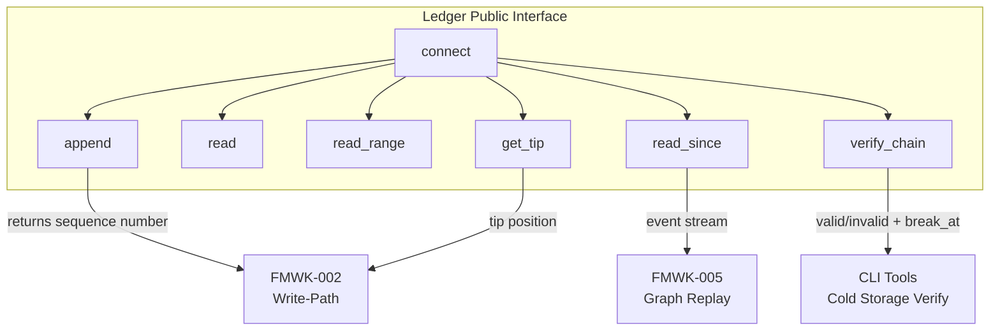

<details>
<summary>Method signatures</summary>

```python
class Ledger:
    def connect(self, config: LedgerConfig) -> None
    def append(self, event: dict) -> int          # returns sequence number
    def read(self, sequence_number: int) -> LedgerEvent
    def read_range(self, start: int, end: int) -> list[LedgerEvent]
    def read_since(self, sequence_number: int) -> list[LedgerEvent]
    def get_tip(self) -> LedgerTip
    def verify_chain(self, start: int = 0, end: int | None = None) -> VerifyChainResult
```

</details>

---

## Architecture

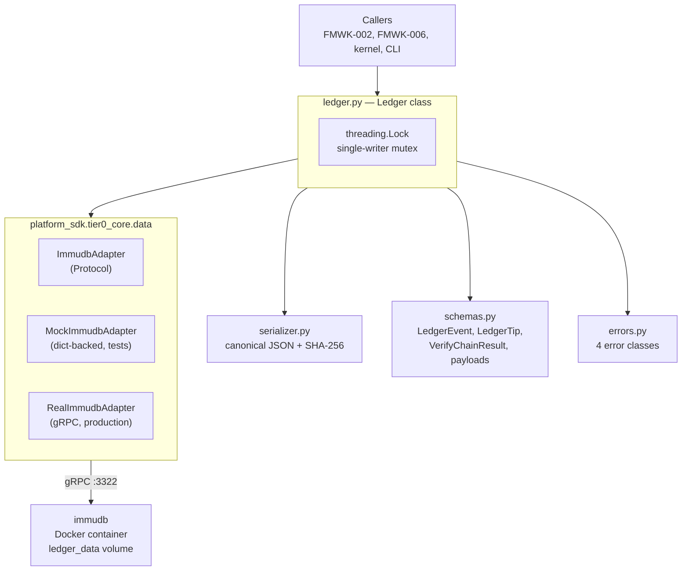

---

## How append() Works

The most critical data flow — every state mutation in DoPeJarMo goes through this path.

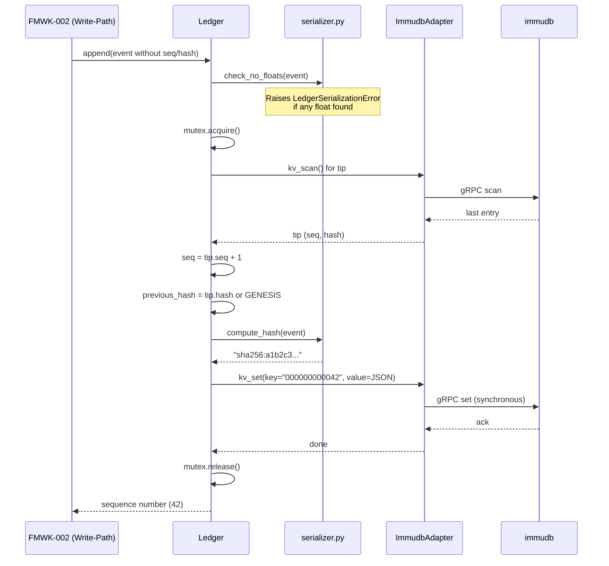

---

## How verify_chain() Works

Can run with the kernel completely stopped — only needs immudb. This is the cold-storage verification guarantee.

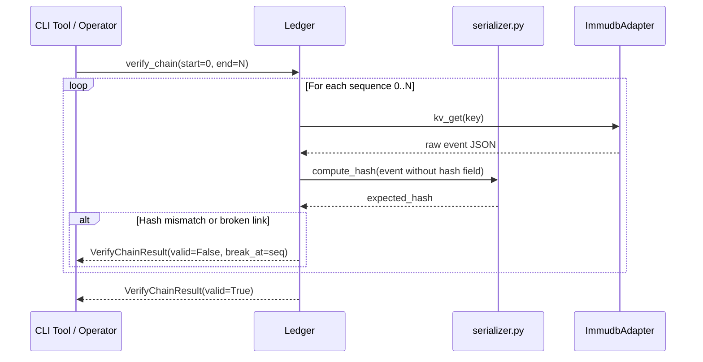

---

## File Structure

Everything lives in `staging/FMWK-001-ledger/` — never touches the governed filesystem.

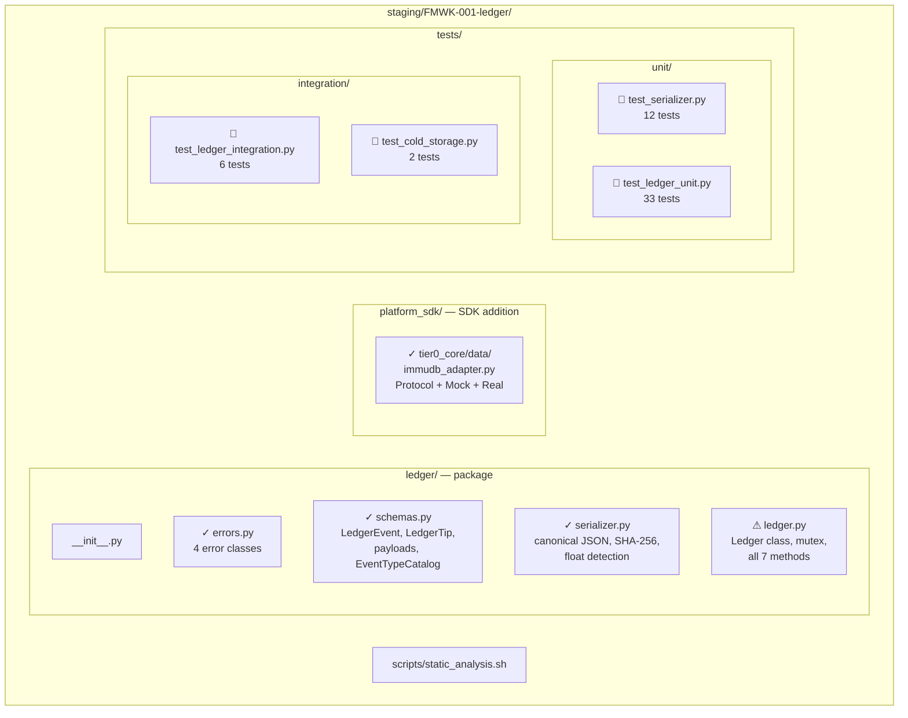

**Legend:** ✓ = low risk, ⚠ = high risk (mutex + atomicity), 🧪 = tests

---

## Build Phases and Task Dependencies

12 tasks across 4 phases, executed in 6 serial waves.

```mermaid
gantt
    title FMWK-001 Build Phases
    dateFormat X
    axisFormat %s

    section Phase 0 — Foundation
        T-001 errors.py           :a1, 0, 1
        T-002 schemas.py          :a2, 0, 1
        T-003 serializer.py       :a3, 0, 1
        T-004 immudb adapter      :a4, 0, 1

    section Phase 2 — Core Ledger
        T-005 Ledger.connect      :a5, after a1, 1
        T-006 append + get_tip    :a6, after a5, 2
        T-007 read methods        :a7, after a5, 1
        T-008 verify_chain        :a8, after a5, 1

    section Phase 3 — Validation
        T-009 reconnect tests     :a9, after a6, 1
        T-010 complete unit suite :a10, after a9, 1
        T-011 integration tests   :a11, after a10, 1
        T-012 static analysis     :a12, after a10, 1
```

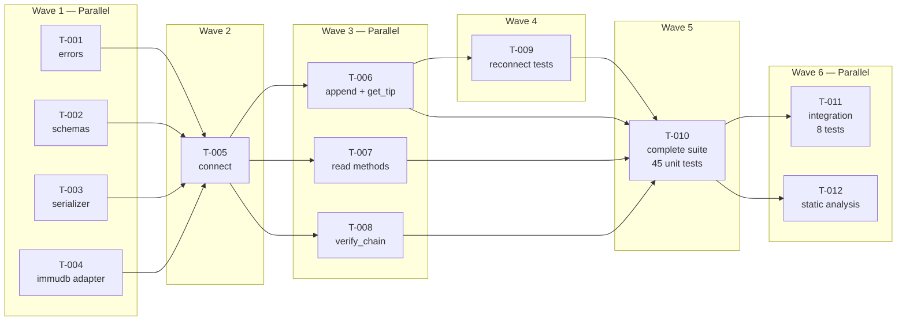

---

## Test Coverage Map

53 tests total. Every D2 scenario is covered.

| Test File | Count | What it covers | Needs Docker? |
|-----------|-------|---------------|---------------|
| `test_serializer.py` | 12 | Canonical JSON, hash format, float detection, genesis sentinel | No |
| `test_ledger_unit.py` | 33 | All 13 D2 scenarios via MockProvider — connect, append, read, verify, reconnect | No |
| `test_ledger_integration.py` | 6 | Real immudb: roundtrip, 1000-event chain, read_since, missing DB | Yes |
| `test_cold_storage.py` | 2 | SC-005: verify_chain with kernel stopped, only immudb running | Yes |
| **Total** | **53** | | |

### Scenario Coverage

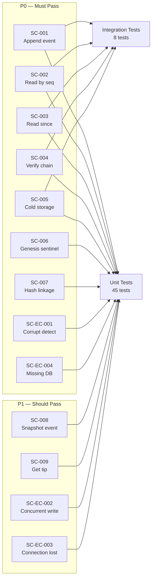

---

## Data Model — What an Event Looks Like

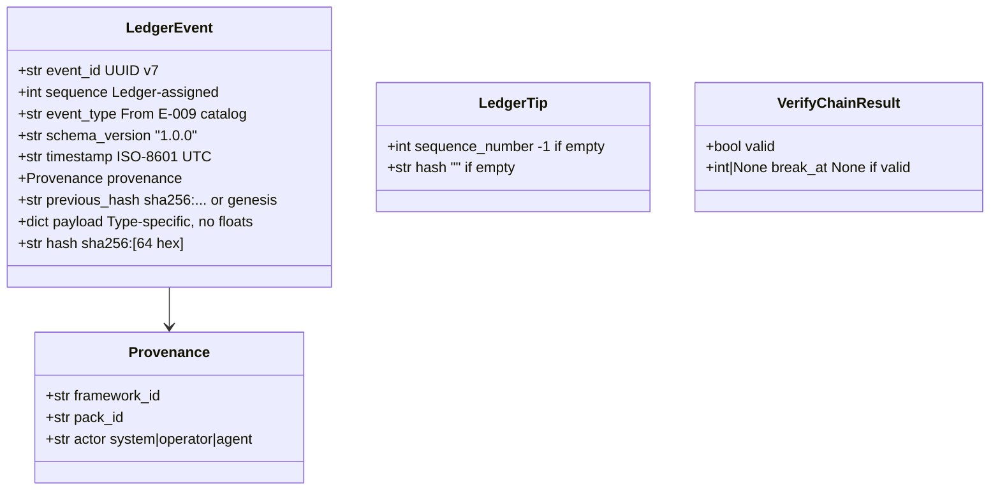

### Hash Chain Linkage

```
Event 0: previous_hash = GENESIS_SENTINEL (64 zeros)
         hash = sha256(canonical_json(event_0))

Event 1: previous_hash = event_0.hash
         hash = sha256(canonical_json(event_1))

Event 2: previous_hash = event_1.hash
         hash = sha256(canonical_json(event_2))
         ...
```

Every event links to its predecessor. `verify_chain()` walks this entire chain and recomputes every hash from scratch. If any link is broken, it returns exactly where.

---

## Error Handling

Four error classes, all non-retryable. The Ledger never retries internally — callers decide recovery.

| Error | Code | When | Severity |
|-------|------|------|----------|
| `LedgerConnectionError` | `LEDGER_CONNECTION_ERROR` | immudb unreachable, missing DB, reconnect failed | System hard-stop |
| `LedgerCorruptionError` | `LEDGER_CORRUPTION_ERROR` | Hash chain mismatch during verify | Catastrophic — manual investigation |
| `LedgerSequenceError` | `LEDGER_SEQUENCE_ERROR` | Concurrent write conflict | Fatal — single-writer invariant breached |
| `LedgerSerializationError` | `LEDGER_SERIALIZATION_ERROR` | Float in payload, unserializable type | Programming error in caller |

---

## Dependencies

### What Ledger Depends On

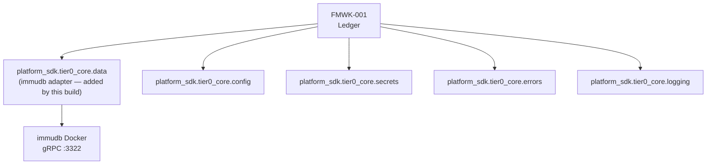

### What Depends on Ledger

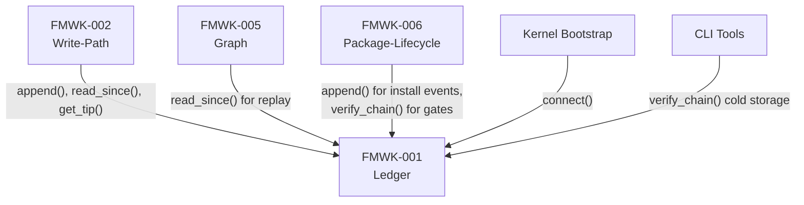

---

## Constitutional Rules (D1)

Nine articles that the builder cannot violate. Static analysis (T-012) enforces several of these at build time.

| Article | Rule | Enforced By |
|---------|------|-------------|
| 1. SPLITTING | Independently authorable, zero cross-framework deps | T-012 static grep |
| 2. MERGING | No fold, signal, gate, or Graph logic | T-012 static grep |
| 3. OWNERSHIP | Sole owner of base schema fields | T-012 static grep |
| 4. APPEND-ONLY | Zero admin operation calls | T-012 static grep |
| 5. DETERMINISTIC HASH | Every event linked via sha256 | Unit + integration tests |
| 6. SEQUENCE MONOTONICITY | Ledger assigns sequence, not caller | T-012 signature check |
| 7. IMMUDB ABSTRACTION | All access through platform_sdk | T-012 import grep |
| 8. COLD-STORAGE | verify_chain works without kernel | `test_cold_storage.py` |
| 9. INFRASTRUCTURE SEPARATION | connect() fails on missing DB, never creates it | Unit test |

---

## Gaps, Questions, and Concerns

Also tracked on the [global Status and Gaps page](../status.md).

### Resolved Gaps (from D6)

| Gap | Status | Impact |
|-----|--------|--------|
| GAP-1: Payload schemas for 10 deferred event types | Deferred to owning frameworks | None for FMWK-001 build |
| GAP-2: Snapshot file format | Deferred to FMWK-005 | Ledger payload is format-agnostic |
| GAP-3: Authorization for append() callers | Architectural (Docker network) | No code-level auth needed |
| GAP-4: Metric names, health probe | Builder follows SDK conventions | Acceptable for KERNEL |

### Resolved Issues (from evidence extraction — 2026-03-09)

These were found by comparing specs against the live SDK code. All resolved.

| Issue | Resolution |
|-------|-----------|
| `PlatformConfig` has no immudb fields | FIXED — `immudb_host`/`port`/`database`/`username`/`password` added to `config.py` (dopejar `d2a769c`) |
| Live SDK has `data.py` not `data/` | CLARIFIED — `tier0_core.data` is a flat module (`data.py`); staging adds `data/` package independently (see D6 CLR-002) |
| Live SDK calls `createDatabaseV2` | FIXED — removed from `ImmudbProvider.__init__`; fails closed with `LedgerConnectionError` (dopejar `d2a769c`) |
| IN-002 edge case (read out of range) | COVERED — D4 IN-002 specifies `LedgerConnectionError` for out-of-range reads |
| IN-005 error (verify when immudb down) | COVERED — D4 IN-005 specifies `LedgerConnectionError` when immudb unreachable |
| IN-006 error (get_tip when immudb down) | COVERED — D4 IN-006 specifies `LedgerConnectionError` when immudb unreachable |

---

## Spec Documents

All produced during Spec Writing (A) through Acceptance Test Writing (C). Stored in `sawmill/FMWK-001-ledger/`.

| Document | What it covers |
|----------|---------------|
| D1 — Constitution | 9 articles, ALWAYS/ASK/NEVER boundaries |
| D2 — Specification | 13 scenarios (9 happy path, 4 edge case) |
| D3 — Data Model | LedgerEvent, LedgerTip, VerifyChainResult, payloads |
| D4 — Contracts | 7 inbound, 4 outbound, 3 side-effect, 4 error |
| D5 — Research | Atomicity, key format, hash algorithm decisions |
| D6 — Gap Analysis | 4 gaps, all resolved. Gate: PASS |
| D7 — Plan | Architecture, components, file structure, test strategy |
| D8 — Tasks | 12 tasks, 4 phases, 6 waves |
| D9 — Holdouts | Hidden from builder (Acceptance Test Writing (C) output) |
| D10 — Agent Context | Builder's handbook |

Source files: `sawmill/FMWK-001-ledger/` in the Brain Factory repo.

---

## Complexity Estimates

| Component | Lines (est.) | Risk |
|-----------|-------------|------|
| `errors.py` | ~40 | Low |
| `schemas.py` | ~180 | Low |
| `serializer.py` | ~80 | Medium — byte-level contract |
| `immudb_adapter.py` | ~200 | Medium — gRPC wrapper |
| `ledger.py` | ~280 | **High** — mutex + atomicity + reconnect |
| Source total | **~810** | |
| Test total | **~900** | |
| **Grand total** | **~1,710** | |
