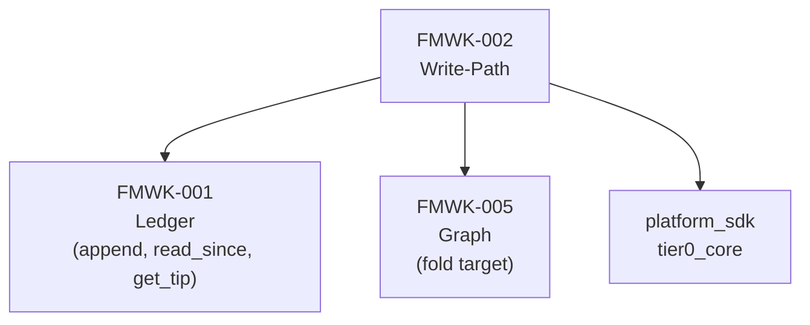
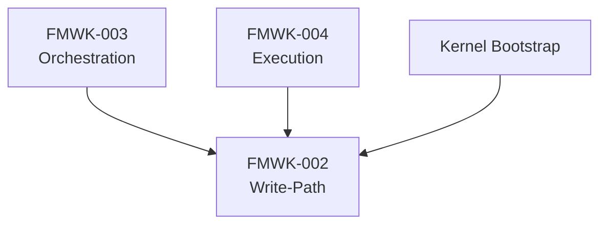
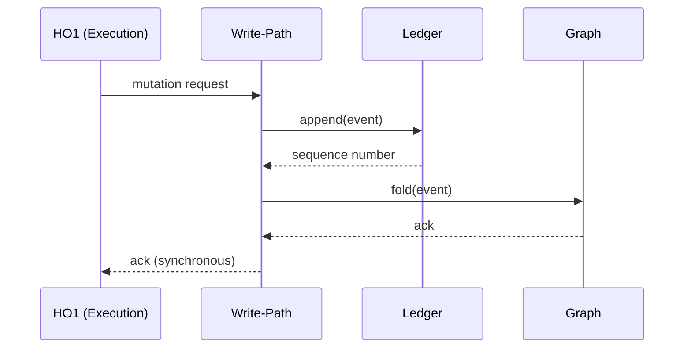

# FMWK-002 Write-Path — Build Status

**Status:** Waiting on FMWK-001 Ledger (Turn D completion).
**What it is:** Synchronous mutation path. Every state change in DoPeJarMo flows through here: append to Ledger, fold into Graph, compute methylation values.
**Primitives:** Write Path, Signal Accumulator
**Risk level:** HIGH — touches the most critical pieces (Ledger integration, fold logic, signal accumulation)

---

## Why This Framework Matters

Write-Path owns the **core architectural invariant**:

> LLM structures at write time. HO2 retrieves mechanically at read time. Never reverse.

If this invariant breaks, the entire system drifts. Every downstream framework depends on Write-Path doing this correctly.

---

## Dependencies

### What Write-Path Depends On

### What Depends on Write-Path

---

## What We KNOW (from Architecture Docs)

These details come from NORTH_STAR, BUILDER_SPEC, and BUILD-PLAN. They are design authority, not spec output.

### Known Interfaces

| Operation | Description |
|-----------|-------------|
| Append event to Ledger | Every mutation creates a Ledger event via `append()` |
| Fold into Graph | After append, fold the event into the in-memory Graph |
| Return ack | Synchronous — caller waits for both append + fold |
| Snapshot at session boundaries | Persist Graph state at session end |
| Retroactive healing | Re-fold with new logic (replay from Ledger) |

### Signal Accumulator

| Property | What We Know |
|----------|-------------|
| Value range | 0.0 to 1.0 (methylation values) |
| Location | On Graph nodes |
| Update path | Through Write-Path only |
| Read path | HO2 reads mechanically — no LLM involvement |

### Known Data Flow

---

## What We DON'T KNOW Yet

These will be determined during Spec Writing (Turn A). No guessing.

| Area | Status | Notes |
|------|--------|-------|
| Fold logic implementation | To be determined during Spec Writing | How events transform into Graph state |
| Methylation computation formula | To be determined during Spec Writing | How signal values are calculated and updated |
| Snapshot format | To be determined during Spec Writing | Deferred from FMWK-001 (GAP-2) |
| Retroactive healing mechanics | To be determined during Spec Writing | How re-fold detects what needs healing |
| Error handling strategy | To be determined during Spec Writing | What happens when fold fails after append succeeds |
| Concurrency model | To be determined during Spec Writing | Single-writer? Mutex? Queue? |
| Event types owned | To be determined during Spec Writing | Which payload schemas Write-Path defines |

---

## What This Framework Owns vs. Does NOT Own

| Owns | Does NOT Own |
|------|-------------|
| Synchronous mutation path | Ledger storage (FMWK-001) |
| Fold logic (event to Graph state) | Graph data structure (FMWK-005) |
| Signal accumulator computation | Work order planning (FMWK-003) |
| Methylation value updates | LLM calls (FMWK-004) |
| Snapshot creation at session boundaries | Gate running, install/uninstall (FMWK-006) |
| Retroactive healing (re-fold) | Hash chain integrity (FMWK-001) |

---

## What Needs to Happen Before Spec Writing

1. **FMWK-001 Ledger Turn D (Builder)** must complete — Write-Path calls `append()`, `read_since()`, `get_tip()`
2. **FMWK-001 Turn E (Evaluator)** must pass — confirms Ledger is reliable
3. **Resolve FMWK-001 open issues** — the 3 contradictions and 3 missing items found during evidence extraction
4. Then: Spec Agent runs Turn A for FMWK-002, producing D1-D6

---

## Gaps, Questions, and Concerns

Also tracked on the [global Status and Gaps page](../status.md).

### Open Questions (need answers during Spec Writing)

| ID | Question | Why it matters |
|----|----------|---------------|
| Q-001 | How exactly does fold logic work? | Events become Graph state — but what's the transformation? This is the core of Write-Path. |
| Q-002 | What happens when fold fails after Ledger append succeeds? | Ledger has the event but Graph doesn't reflect it. System is inconsistent. Rollback? Retry? Hard-stop? |
| Q-003 | What is the snapshot format? | FMWK-001 deferred this (GAP-2). FMWK-005 must define format, but Write-Path writes them. Three-way dependency. |
| Q-004 | How is methylation computed from signal deltas? | Architecture says "continuous value 0.0-1.0" but no formula. Accumulation rate? Decay? |
| Q-005 | What event types does Write-Path own? | Which of the 15 event types have payload schemas defined here vs. by other frameworks? |
| Q-006 | How does retroactive healing detect what needs re-folding? | "Delete Graph, replay from Genesis" — but is this always full replay or can it be incremental? |

### Known Concerns

| Concern | Why it matters | Mitigation |
|---------|---------------|-----------|
| **HIGHEST RISK framework** | BUILD-PLAN explicitly flags this. Everything downstream blocks on it. | Spec pack must be written with extreme precision. Include concrete fold examples. |
| **Three-way snapshot dependency** | FMWK-001 records snapshot events, FMWK-002 writes them, FMWK-005 defines the format. | Resolve during FMWK-002 + FMWK-005 spec writing. May need a shared decision before either starts. |
| **Signal accumulator precision** | Values stored as strings (CLR-003), but computation uses real arithmetic. Where does string-to-number-to-string conversion happen? | Must be specified precisely to avoid cross-language drift. |
| **Fold-after-append consistency** | Synchronous guarantee means fold failure blocks the caller. Too slow = system latency. Too fast = correctness risk. | Performance target needed in spec. |

### Dependencies on Other Frameworks' Decisions

| From | What we need from them | Status |
|------|----------------------|--------|
| FMWK-001 Ledger | Working `append()`, `read_since()`, `get_tip()` | Waiting on Code Building |
| FMWK-005 Graph | Snapshot format agreement | Not started — must co-resolve |

---

## Complexity Estimate

| Aspect | Assessment |
|--------|-----------|
| Risk | **HIGH** — per BUILD-PLAN, this is the highest risk item |
| Why high risk | Fold logic correctness, signal accumulation precision, snapshot reliability |
| Dependency depth | Direct consumer of Ledger, direct producer for Graph |
| Critical path | Yes — FMWK-003 Orchestration is blocked on this |

---

## Spec Documents

None yet. Will be produced during Turns A-C.

| Document | Status |
|----------|--------|
| D1 — Constitution | Not started |
| D2 — Specification | Not started |
| D3 — Data Model | Not started |
| D4 — Contracts | Not started |
| D5 — Research | Not started |
| D6 — Gap Analysis | Not started |
| D7 — Plan | Not started |
| D8 — Tasks | Not started |
| D9 — Holdouts | Not started |
| D10 — Agent Context | Not started |
