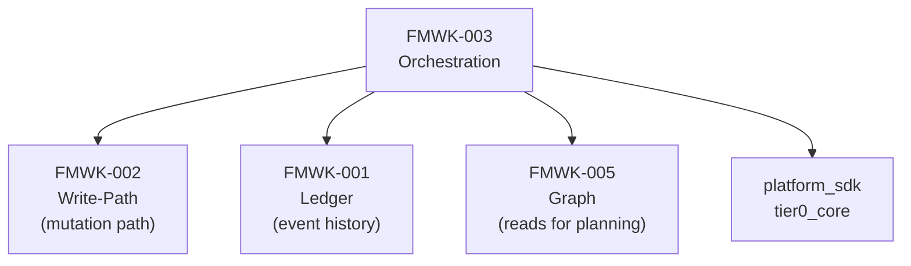
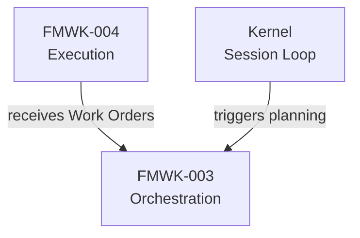
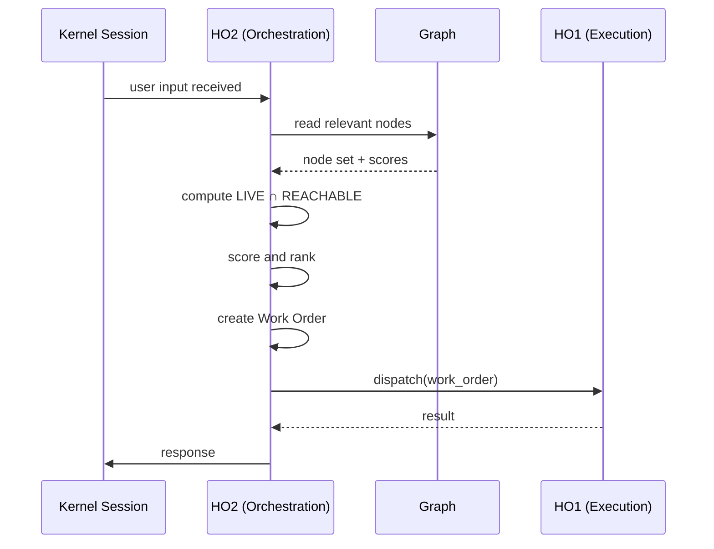

# FMWK-003 Orchestration — Build Status

**Status:** Waiting on FMWK-002 Write-Path.
**What it is:** Mechanical planning engine. Reads Graph, plans work orders, dispatches to HO1. NO LLM.
**Primitives:** HO2 (Orchestration), Work Orders
**Risk level:** HIGH — work order state machine, planning heuristics, scoring formula

---

## Why This Framework Matters

HO2 is the brain's planner. It decides what work needs doing, in what order, with what context — all mechanically. The critical design constraint: **HO2 never calls an LLM**. It reads the Graph, computes what matters, and dispatches Work Orders to HO1.

---

## Dependencies

### What Orchestration Depends On



### What Depends on Orchestration



---

## What We KNOW (from Architecture Docs)

### Core Responsibilities

| Responsibility | Description |
|---------------|-------------|
| LIVE intersection REACHABLE | Compute which Graph nodes are relevant right now |
| Aperture determination | How wide to search the Graph for context |
| Work order lifecycle | Create, dispatch, track, complete/fail work orders |
| Intent transition resolution | When user intent shifts, manage the transition |

### Known Weight Formula

```
score = field_match x base_weight x recency x outcome x (1 - M)
```

Where `M` is the methylation value (0.0-1.0). Higher methylation suppresses a node's relevance.

### Known Work Order Fields

| Field | Type | Description |
|-------|------|-------------|
| `wo_id` | str | Unique work order identifier |
| `type` | str | Type of work to be done |
| `tier_target` | str | Which tier handles this work |
| `input_context` | dict | Context for the executor |
| `constraints` | dict | Boundaries for execution |
| `parent_wo` | str or None | For chained work orders |
| `tool_permissions` | list | What tools the executor may use |

### Known Data Flow



---

## What We DON'T KNOW Yet

| Area | Status | Notes |
|------|--------|-------|
| Work order state machine | To be determined during Spec Writing | States, transitions, failure handling |
| Aperture algorithm | To be determined during Spec Writing | How width is computed from context |
| LIVE intersection REACHABLE computation | To be determined during Spec Writing | Exact algorithm for determining relevant nodes |
| Intent transition rules | To be determined during Spec Writing | When and how intent shifts are detected |
| Planning heuristics | To be determined during Spec Writing | Decision rules for work order creation |
| Concurrency model | To be determined during Spec Writing | Can multiple work orders execute in parallel? |
| Error/retry strategy | To be determined during Spec Writing | What happens when a work order fails |

---

## What This Framework Owns vs. Does NOT Own

| Owns | Does NOT Own |
|------|-------------|
| Work order creation and lifecycle | LLM calls (FMWK-004) |
| Planning and dispatch logic | Graph data structure (FMWK-005) |
| LIVE intersection REACHABLE computation | Fold logic, signal accumulation (FMWK-002) |
| Aperture determination | Ledger storage (FMWK-001) |
| Scoring formula application | Prompt contract enforcement (FMWK-004) |
| Intent transition resolution | Gate running, packaging (FMWK-006) |

**CRITICAL CONSTRAINT:** HO2 is mechanical only. If you find yourself adding LLM calls to this framework, STOP. You are violating the core invariant.

---

## What Needs to Happen Before Spec Writing

1. **FMWK-001 Ledger** must pass Turn E (Evaluation)
2. **FMWK-002 Write-Path** must complete Turns A-E — Orchestration dispatches mutations through Write-Path
3. Then: Spec Agent runs Turn A for FMWK-003, producing D1-D6

---

## Gaps, Questions, and Concerns

Also tracked on the [global Status and Gaps page](../status.md).

### Open Questions (need answers during Spec Writing)

| ID | Question | Why it matters |
|----|----------|---------------|
| Q-001 | What exactly is the work order state machine? | planned→dispatched→executing→completed/failed — but what triggers each transition? What are the guards? |
| Q-002 | How does aperture determination work? | Architecture says "learned prior from regime/mode methylation + current evidence" but no formula. This controls how much work each turn does. |
| Q-003 | What is the exact LIVE ∩ REACHABLE ∩ NOT_SUPPRESSED algorithm? | Architecture names the sets but doesn't specify how reachability is computed. BFS? DFS? Max depth? |
| Q-004 | How are intent transitions resolved? | HO1 proposes, HO2 resolves mechanically from policy. But what policies? What's the resolution algorithm? |
| Q-005 | Can multiple work orders execute in parallel? | Architecture says HO1 is "threaded for concurrent work order execution" but HO2 planning might be sequential. |
| Q-006 | What happens when a work order fails? | Retry? Abort chain? Compensating work order? Parent notification? |

### Known Concerns

| Concern | Why it matters | Mitigation |
|---------|---------------|-----------|
| **Weight formula tuning** | `field_match × base_weight × recency × outcome × (1-M)` — each factor needs concrete computation rules, not just concepts. | Spec must include example calculations with real numbers. |
| **No LLM allowed** | HO2 must be purely mechanical. This means all "intelligence" is in the scoring/planning heuristics, which must be explicitly specified. | D1 Constitution must make this an Article-level NEVER rule. |
| **Routing policy format** | Architecture says routing is "installed by frameworks" but no format specified. | Must be defined in D3 Data Model. |

---

## Complexity Estimate

| Aspect | Assessment |
|--------|-----------|
| Risk | **HIGH** — per BUILD-PLAN |
| Why high risk | Work order state machine complexity, scoring formula tuning, planning heuristics |
| Dependency depth | Depends on FMWK-001 + FMWK-002; reads from FMWK-005 |
| Critical path | Yes — FMWK-004 Execution receives work from this |

---

## Spec Documents

None yet. Will be produced during Turns A-C.

| Document | Status |
|----------|--------|
| D1 — Constitution | Not started |
| D2 — Specification | Not started |
| D3 — Data Model | Not started |
| D4 — Contracts | Not started |
| D5 — Research | Not started |
| D6 — Gap Analysis | Not started |
| D7 — Plan | Not started |
| D8 — Tasks | Not started |
| D9 — Holdouts | Not started |
| D10 — Agent Context | Not started |
