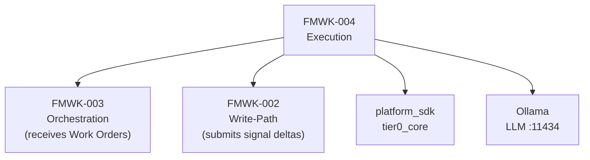
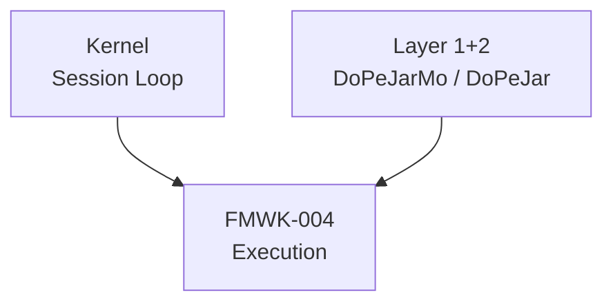
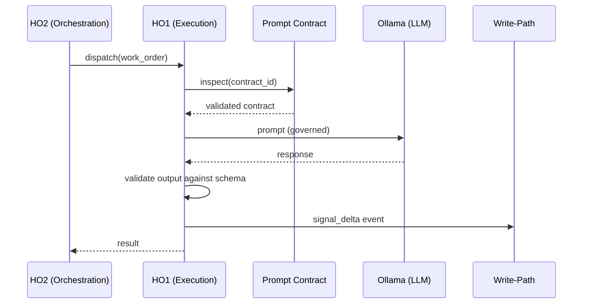

# FMWK-004 Execution — Build Status

**Status:** Waiting on FMWK-003 Orchestration and FMWK-002 Write-Path.
**What it is:** All LLM calls go through here. Prompt contract enforcement. One mouth. Signal delta submission.
**Primitives:** HO1 (Execution), Prompt Contracts
**Risk level:** MEDIUM — prompt contract enforcement, LLM routing, budget tracking

---

## Why This Framework Matters

HO1 is the only thing in DoPeJarMo that talks to LLMs. Every LLM interaction is governed by a Prompt Contract. This is how the system prevents uncontrolled generation, hallucination, or drift.

---

## Dependencies

### What Execution Depends On

### What Depends on Execution

Execution is a leaf in the KERNEL dependency chain — nothing else in KERNEL depends on it directly.

---

## What We KNOW (from Architecture Docs)

### Core Responsibilities

| Responsibility | Description |
|---------------|-------------|
| Stateless single-shot workers | Each execution is independent, no carried state |
| Prompt pack inspection | Validate contract before calling LLM |
| Signal delta events | Submit signal_delta events for active intent scope after execution |
| One mouth | All LLM access goes through HO1, nowhere else |

### Known Prompt Contract Fields

| Field | Type | Description |
|-------|------|-------------|
| `contract_id` | str | Unique contract identifier |
| `boundary` | str | What the LLM is allowed to do |
| `input_schema` | dict | Expected input structure |
| `output_schema` | dict | Expected output structure |
| `prompt_template` | str | The actual prompt with placeholders |
| `validation_rules` | list | Rules to validate LLM output |

### Known Data Flow

---

## What We DON'T KNOW Yet

| Area | Status | Notes |
|------|--------|-------|
| LLM routing logic | To be determined during Spec Writing | How to select which model for which task |
| Budget tracking mechanism | To be determined during Spec Writing | Token counting, limits, alerts |
| Output validation implementation | To be determined during Spec Writing | How validation_rules are enforced |
| Retry/fallback on LLM failure | To be determined during Spec Writing | Timeout, retry count, fallback model |
| Signal delta computation | To be determined during Spec Writing | How execution results become signal deltas |
| Prompt template rendering | To be determined during Spec Writing | Variable substitution, context injection |
| Contract versioning | To be determined during Spec Writing | How contracts evolve over time |

---

## What This Framework Owns vs. Does NOT Own

| Owns | Does NOT Own |
|------|-------------|
| All LLM calls | Planning and dispatch (FMWK-003) |
| Prompt contract enforcement | Work order lifecycle (FMWK-003) |
| Output validation against schemas | Graph storage (FMWK-005) |
| Signal delta submission | Fold logic, signal accumulation (FMWK-002) |
| Budget/token tracking | Ledger storage (FMWK-001) |
| LLM routing decisions | Methylation value computation (FMWK-002) |

**CRITICAL CONSTRAINT:** HO1 workers are stateless. Each execution is a single shot. If you find yourself adding state between executions, STOP. You are drifting.

---

## What Needs to Happen Before Spec Writing

1. **FMWK-002 Write-Path** must complete — Execution submits signal deltas through Write-Path
2. **FMWK-003 Orchestration** must complete — Execution receives Work Orders from Orchestration
3. Then: Spec Agent runs Turn A for FMWK-004, producing D1-D6
4. Note: FMWK-004 can potentially run in parallel with FMWK-003 per BUILD-PLAN

---

## Gaps, Questions, and Concerns

Also tracked on the [global Status and Gaps page](../status.md).

### Open Questions (need answers during Spec Writing)

| ID | Question | Why it matters |
|----|----------|---------------|
| Q-001 | How are prompt contracts versioned and updated? | Contracts will evolve. How do we handle backward compatibility? Migration? |
| Q-002 | How does LLM routing policy work? | Architecture says "mechanical: HO2 reads policy, matches work order type to provider" — but what's the policy format? |
| Q-003 | What is the budget/token tracking model? | Each work order has a token budget. What happens when budget is exceeded mid-generation? |
| Q-004 | How are signal deltas computed from execution results? | HO1 submits signal_delta events — but what determines the delta value from a completed work order? |
| Q-005 | What is the retry/fallback strategy for LLM failures? | Timeout, retry count, fallback model, circuit breaker? |

### Known Concerns

| Concern | Why it matters | Mitigation |
|---------|---------------|-----------|
| **Stateless constraint** | HO1 workers are single-shot. No state between executions. If you need state, something is wrong. | D1 Constitution: NEVER maintain state between work order executions. |
| **One mouth** | All LLM calls go through HO1. No other component can call an LLM directly. Violation breaks auditability. | Static analysis gate (like FMWK-001's T-012) to verify no LLM imports outside HO1. |
| **Prompt Pack Inspection is a work order** | Not a separate mechanism — normal dispatch with type=classify. Must not be special-cased. | Spec must define it as a regular work order type, not a separate code path. |

---

## Complexity Estimate

| Aspect | Assessment |
|--------|-----------|
| Risk | **MEDIUM** — per BUILD-PLAN |
| Why medium risk | Prompt contract is well-defined; LLM routing and budget are bounded problems |
| Dependency depth | Receives from FMWK-003, writes through FMWK-002 |
| Critical path | No — leaf node in KERNEL dependency chain |

---

## Spec Documents

None yet. Will be produced during Turns A-C.

| Document | Status |
|----------|--------|
| D1 — Constitution | Not started |
| D2 — Specification | Not started |
| D3 — Data Model | Not started |
| D4 — Contracts | Not started |
| D5 — Research | Not started |
| D6 — Gap Analysis | Not started |
| D7 — Plan | Not started |
| D8 — Tasks | Not started |
| D9 — Holdouts | Not started |
| D10 — Agent Context | Not started |
