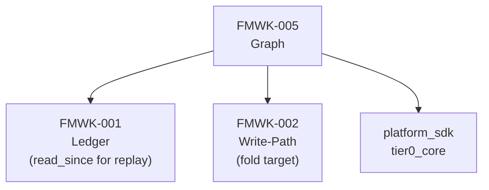
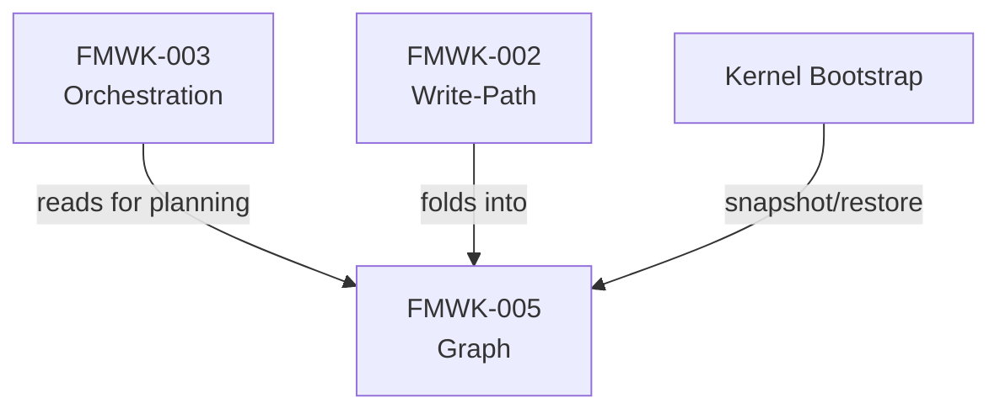
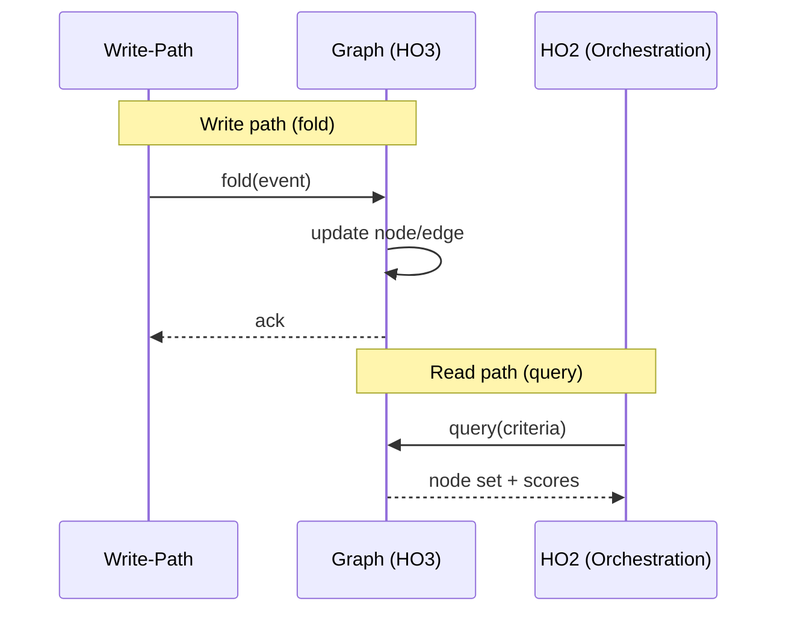

# FMWK-005 Graph — Build Status

**Status:** Waiting on FMWK-002 Write-Path.
**What it is:** In-memory materialized view derived from Ledger. Pure storage. Never executes.
**Primitives:** HO3 (Graph)
**Risk level:** MEDIUM — node/edge schemas, query interface, snapshot format

---

## Why This Framework Matters

HO3 is where DoPeJarMo's memory lives at runtime. It is a directed graph materialized from the Ledger — every node, edge, and methylation value exists because a Ledger event put it there via Write-Path fold.

> **If you are adding active execution to HO3 — STOP. You are drifting.**

HO3 is pure storage. It does not plan, decide, or call LLMs. HO2 reads it mechanically. Write-Path folds into it. That's the contract.

---

## Dependencies

### What Graph Depends On

### What Depends on Graph

---

## What We KNOW (from Architecture Docs)

### Node Properties

| Property | Type | Description |
|----------|------|-------------|
| Methylation value | float (0.0-1.0) | Signal accumulation — higher = more suppressed |
| Suppression mask | To be determined | Controls visibility/reachability |
| Lifecycle status | str | Node state in its lifecycle |
| Base weight | float | Intrinsic importance of the node |
| Timestamps | datetime | Created, last modified |
| Outcome history | list | Track record of past outcomes |

### Edge Properties

| Property | Description |
|----------|-------------|
| Work order chains | Links between related work orders |
| Intent hierarchy | Parent-child intent relationships |
| Explicit references | User or system-created links |

### Core Responsibilities

| Responsibility | Description |
|---------------|-------------|
| Node/edge storage | Directed graph with typed nodes and edges |
| Scoring/retrieval queries | HO2 queries for LIVE intersection REACHABLE |
| Snapshot/replay | Persist to disk, rebuild from Ledger |

### Known Data Flow

---

## What We DON'T KNOW Yet

| Area | Status | Notes |
|------|--------|-------|
| Node schema (complete) | To be determined during Spec Writing | Full field list beyond what BUILDER_SPEC provides |
| Edge schema (complete) | To be determined during Spec Writing | Edge types, weights, metadata |
| Query interface | To be determined during Spec Writing | Method signatures, filter/sort capabilities |
| Snapshot format | To be determined during Spec Writing | Deferred from FMWK-001 (GAP-2) — this framework decides |
| Replay mechanics | To be determined during Spec Writing | How to rebuild from Ledger events |
| Graph traversal algorithms | To be determined during Spec Writing | BFS, DFS, reachability computation |
| Memory management | To be determined during Spec Writing | Max size, eviction, pruning |

---

## What This Framework Owns vs. Does NOT Own

| Owns | Does NOT Own |
|------|-------------|
| In-memory directed graph structure | Fold logic (FMWK-002 — Write-Path folds INTO Graph) |
| Node/edge schemas and storage | Planning and scoring (FMWK-003 — reads FROM Graph) |
| Query interface for HO2 | LLM calls (FMWK-004) |
| Snapshot and replay | Signal accumulator computation (FMWK-002) |
| Methylation value storage | Methylation value updates (FMWK-002) |

**CRITICAL CONSTRAINT:** HO3 is pure storage. It stores what Write-Path tells it to store, and it answers queries from HO2. It never initiates action, never calls LLMs, never makes decisions.

---

## What Needs to Happen Before Spec Writing

1. **FMWK-002 Write-Path** must complete — defines how events fold into Graph
2. Graph can potentially run in parallel with FMWK-003 per BUILD-PLAN
3. Then: Spec Agent runs Turn A for FMWK-005, producing D1-D6

---

## Gaps, Questions, and Concerns

Also tracked on the [global Status and Gaps page](../status.md).

### Open Questions (need answers during Spec Writing)

| ID | Question | Why it matters |
|----|----------|---------------|
| Q-001 | What is the Graph query interface? | Architecture says "scoring/retrieval queries" — but no API defined. Method signatures? Filter capabilities? |
| Q-002 | What is the snapshot format? | FMWK-001 deferred this (GAP-2). This framework must define it. FMWK-002 Write-Path writes snapshots using this format. |
| Q-003 | What triggers snapshot vs. replay? | Architecture says "session boundaries" — but what about crashes? Partial snapshots? Corruption? |
| Q-004 | How is reachability computed? | FMWK-003 needs LIVE ∩ REACHABLE — but the traversal algorithm lives here in the Graph query interface. |
| Q-005 | What are the memory management constraints? | Max nodes? Max edges? Eviction policy when memory pressure hits? |
| Q-006 | How are edges typed and weighted? | Work order chains, intent hierarchy, explicit references — are these different edge types? Do edges have weights? |

### Known Concerns

| Concern | Why it matters | Mitigation |
|---------|---------------|-----------|
| **Pure storage — no execution** | "If you are adding active execution to HO3 — STOP. You are drifting." This is the most commonly violated constraint. | D1 Constitution must make this the first Article. Every code review checks for it. |
| **Snapshot format is cross-cutting** | FMWK-001 records it, FMWK-002 writes it, FMWK-005 defines it. All three must agree. | May need a pre-spec design session to resolve format before any of these start Spec Writing. |
| **Replay correctness** | "Destroy and rebuild from Ledger at any time" — but replay must produce identical Graph state. How do we verify this? | Need a test strategy: snapshot, destroy, replay, compare. Must be specified in D2 scenarios. |

---

## Complexity Estimate

| Aspect | Assessment |
|--------|-----------|
| Risk | **MEDIUM** — per BUILD-PLAN |
| Why medium risk | Well-bounded problem (data structure + queries), but snapshot format is novel |
| Dependency depth | Receives from FMWK-002, serves FMWK-003 |
| Critical path | Partially — FMWK-003 reads from it, but can be specified in parallel |

---

## Spec Documents

None yet. Will be produced during Turns A-C.

| Document | Status |
|----------|--------|
| D1 — Constitution | Not started |
| D2 — Specification | Not started |
| D3 — Data Model | Not started |
| D4 — Contracts | Not started |
| D5 — Research | Not started |
| D6 — Gap Analysis | Not started |
| D7 — Plan | Not started |
| D8 — Tasks | Not started |
| D9 — Holdouts | Not started |
| D10 — Agent Context | Not started |
