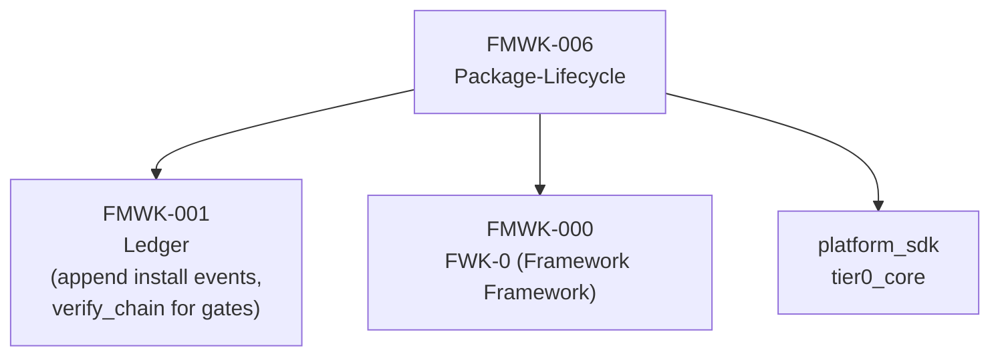
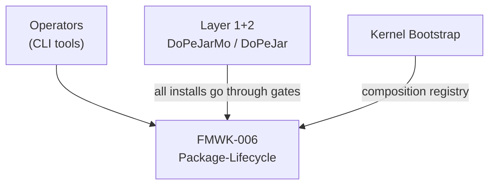
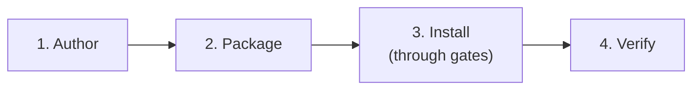

# FMWK-006 Package-Lifecycle — Build Status

**Status:** Waiting on FMWK-001 Ledger.
**What it is:** Gate runner, install/uninstall, composition registry, scaffold/seal/validate/package CLI, cold-storage validation.
**Primitives:** Package Lifecycle, Framework Hierarchy, CLI Tools
**Risk level:** HIGH — gate runner, install logic, composition registry, CLI tools

---

## Why This Framework Matters

Package-Lifecycle is how code gets from "authored" to "installed and running." It enforces the 4-stage lifecycle, runs gates, manages the framework hierarchy, and provides the CLI tools operators use to manage the system.

Without this, there is no governed way to install anything into DoPeJarMo.

---

## Dependencies

### What Package-Lifecycle Depends On



### What Depends on Package-Lifecycle



---

## What We KNOW (from Architecture Docs)

### 4-Stage Lifecycle



| Stage | What Happens |
|-------|-------------|
| Author | Code is written in `staging/<FMWK-ID>/` |
| Package | Code is bundled with metadata, checksums |
| Install | Package passes gates and enters the governed filesystem |
| Verify | Cold-storage validation confirms integrity |

### Framework Hierarchy

```
Framework (FMWK-NNN)
  └── Spec Pack (SPEC-NNN)
       └── Pack (PC-NNN)
            └── File
```

### CLI Tools

| Tool | Purpose |
|------|---------|
| `scaffold` | Create directory structure for a new framework |
| `seal` | Lock a package after authoring |
| `validate` | Run gates against a package |
| `package` | Bundle for installation |

### Known Interfaces with Ledger

| Operation | Ledger Method | Purpose |
|-----------|--------------|---------|
| Record install events | `append()` | Every install/uninstall creates a Ledger event |
| Gate verification | `verify_chain()` | Gates can verify Ledger integrity before installing |

---

## What We DON'T KNOW Yet

| Area | Status | Notes |
|------|--------|-------|
| Gate definitions | To be determined during Spec Writing | What checks each gate performs |
| Composition registry schema | To be determined during Spec Writing | How installed packages are tracked |
| Install/uninstall mechanics | To be determined during Spec Writing | File operations, rollback, atomic install |
| CLI argument specs | To be determined during Spec Writing | Exact flags, options, output formats |
| Cold-storage validation details | To be determined during Spec Writing | Beyond verify_chain — what else gets checked |
| Package metadata format | To be determined during Spec Writing | Manifest structure, checksums, signatures |
| Dependency resolution | To be determined during Spec Writing | How install order is determined |

---

## What This Framework Owns vs. Does NOT Own

| Owns | Does NOT Own |
|------|-------------|
| Gate runner (executing gate checks) | Ledger storage (FMWK-001) |
| Install/uninstall lifecycle | Fold logic (FMWK-002) |
| Composition registry | Work order planning (FMWK-003) |
| CLI tools (scaffold, seal, validate, package) | LLM calls (FMWK-004) |
| Framework hierarchy enforcement | Graph structure (FMWK-005) |
| Cold-storage validation orchestration | Hash chain verification logic (FMWK-001 owns verify_chain) |
| Package metadata and manifests | Event schemas (owned by respective frameworks) |

---

## What Needs to Happen Before Spec Writing

1. **FMWK-001 Ledger** must pass Turn E (Evaluation) — Package-Lifecycle appends install events and uses `verify_chain()` for gates
2. **FMWK-000 (FWK-0)** must be stable — defines the framework hierarchy that Package-Lifecycle enforces
3. Note: Package-Lifecycle does NOT depend on FMWK-002 or FMWK-003, so it can potentially start spec writing earlier than those
4. Then: Spec Agent runs Turn A for FMWK-006, producing D1-D6

---

## Gaps, Questions, and Concerns

Also tracked on the [global Status and Gaps page](../status.md).

### Open Questions (need answers during Spec Writing)

| ID | Question | Why it matters |
|----|----------|---------------|
| Q-001 | What are the exact gate definitions? | FWK-0 defines the concept (framework-gate, pack-gate, etc.) but concrete checks aren't specified. |
| Q-002 | How does the composition registry work? | Multiple frameworks, dependency ordering, conflict detection. What's the data model? |
| Q-003 | What is the package manifest format? | SHA-256 hashes, dependency declarations, framework IDs — but exact JSON schema undefined. |
| Q-004 | How does atomic install work? | "All gates pass → files copied. Any gate fails → entire package rejected." But what about partial failure during copy? |
| Q-005 | What does cold-storage validation check beyond verify_chain? | FMWK-001 owns hash chain verification. What additional checks does FMWK-006 add? |
| Q-006 | How does uninstall work? | Can frameworks be uninstalled? What happens to dependent frameworks? Cascading uninstall? |

### Known Concerns

| Concern | Why it matters | Mitigation |
|---------|---------------|-----------|
| **Gates create the gate system** | KERNEL is hand-verified because FMWK-006 creates the very gate system it would need to pass through. Chicken-and-egg. | KERNEL phase is explicitly hand-verified. First governed install is FMWK-010 (agent-interface). |
| **CLI UX** | scaffold/seal/validate/package are operator-facing tools. Bad UX = operators won't use them. | Spec must include exact CLI argument specs, output formats, error messages. |
| **Shallowest dependency chain** | Only needs FMWK-001 + FMWK-000. Could start spec writing as soon as FMWK-001 passes evaluation. | Opportunity: start FMWK-006 spec writing in parallel with FMWK-002. |

---

## Complexity Estimate

| Aspect | Assessment |
|--------|-----------|
| Risk | **HIGH** — per BUILD-PLAN |
| Why high risk | Gate runner correctness, install atomicity, CLI UX, composition registry integrity |
| Dependency depth | Only depends on FMWK-001 + FMWK-000 (shallow) |
| Critical path | Partially — operators need this to install anything, but other KERNEL frameworks can be tested without it |

---

## Spec Documents

None yet. Will be produced during Turns A-C.

| Document | Status |
|----------|--------|
| D1 — Constitution | Not started |
| D2 — Specification | Not started |
| D3 — Data Model | Not started |
| D4 — Contracts | Not started |
| D5 — Research | Not started |
| D6 — Gap Analysis | Not started |
| D7 — Plan | Not started |
| D8 — Tasks | Not started |
| D9 — Holdouts | Not started |
| D10 — Agent Context | Not started |
