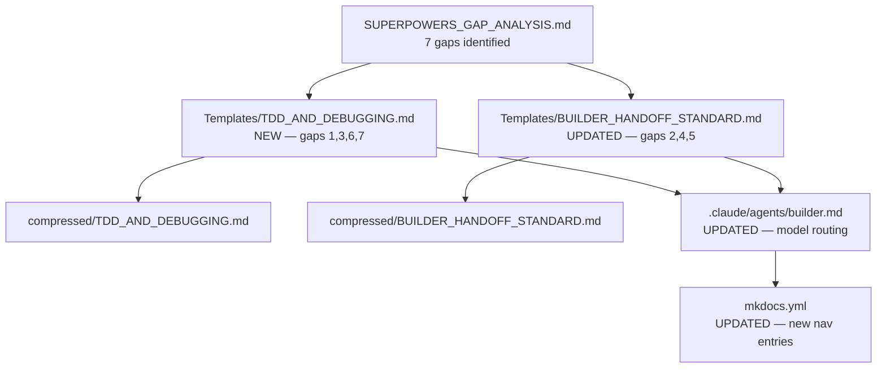
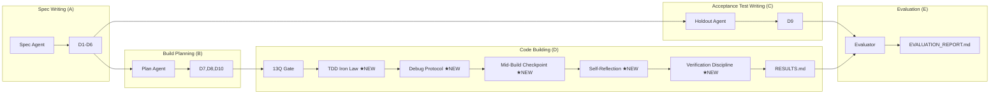
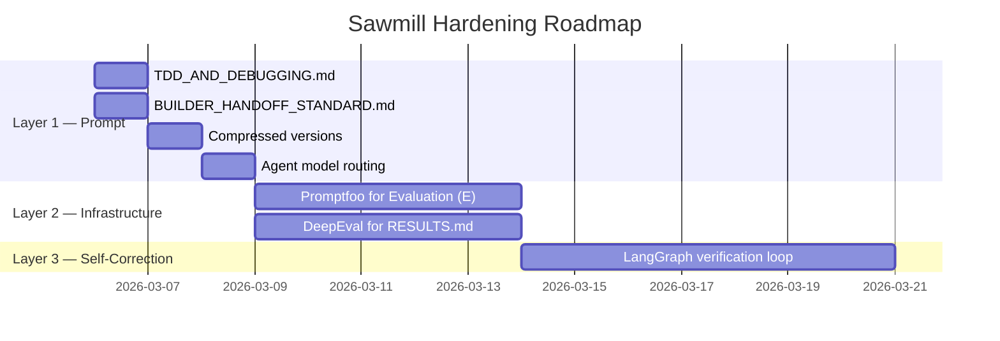

# Sawmill Pipeline Visual

## A. What Gets Built Now

File dependency diagram showing how gap analysis drives the new templates.



<details>
<summary>ASCII fallback</summary>

```
SUPERPOWERS_GAP_ANALYSIS.md (7 gaps)
  |
  +---> Templates/TDD_AND_DEBUGGING.md [NEW — gaps 1,3,6,7]
  |       |
  |       +---> compressed/TDD_AND_DEBUGGING.md
  |       +---> .claude/agents/builder.md [UPDATED — model routing]
  |
  +---> Templates/BUILDER_HANDOFF_STANDARD.md [UPDATED — gaps 2,4,5]
          |
          +---> compressed/BUILDER_HANDOFF_STANDARD.md
          +---> .claude/agents/builder.md
                  |
                  +---> mkdocs.yml [UPDATED — new nav entries]
```

</details>

---

## B. The Sawmill Pipeline

Full turn flow with new pieces highlighted.



<details>
<summary>ASCII fallback</summary>

```
Spec Writing (A)  Build Planning (B)  Acceptance Test Writing (C)
  Spec Agent        Plan Agent          Holdout Agent
  D1-D6 ------+--> D7,D8,D10           D9
              |                          |
              |    Code Building (D)     |
              |      13Q Gate            |
              |        |                 |
              |      TDD Iron Law ★      |
              |        |                 |
              |      Debug Protocol ★    |
              |        |                 |
              |      Mid-Build Chk ★     |
              |        |                 |
              |      Self-Reflect ★      |
              |        |                 |
              |      Verify Disc. ★      |
              |        |                 |
              |      RESULTS.md ---------+---> Evaluation (E)
              |                                Evaluator
              +--------------------------------> EVALUATION_REPORT.md
```

</details>

---

## C. The Three Layers — Roadmap



<details>
<summary>ASCII fallback</summary>

```
Layer 1 — Prompt (NOW)
  [Mar 6]  TDD_AND_DEBUGGING.md
  [Mar 6]  BUILDER_HANDOFF_STANDARD.md
  [Mar 7]  Compressed versions
  [Mar 8]  Agent model routing

Layer 2 — Infrastructure (NEXT, after FMWK-001 Code Building (D))
  [Mar 9-13]  Promptfoo for Evaluation (E) holdout automation
  [Mar 9-13]  DeepEval for RESULTS.md faithfulness checks

Layer 3 — Self-Correction (LATER, after FMWK-002)
  [Mar 14-20]  LangGraph verification loop
```

</details>

---

## What Each Layer Does

**Layer 1 (Prompt)**: Templates that tell builders HOW to code. Works immediately. Honor-system enforcement — the builder is told to follow TDD, verify claims, and debug systematically.

**Layer 2 (Infrastructure)**: Mechanical enforcement. Promptfoo automates Evaluation (E) holdout execution. DeepEval verifies that RESULTS.md claims match actual test output. Layer 1's rules become machine-checked.

**Layer 3 (Self-Correction)**: Feedback loops. Builder output routes through a verification node before proceeding. Replaces the mid-build checkpoint (human review) with mechanical review for routine checks. Human review stays for architectural decisions.
