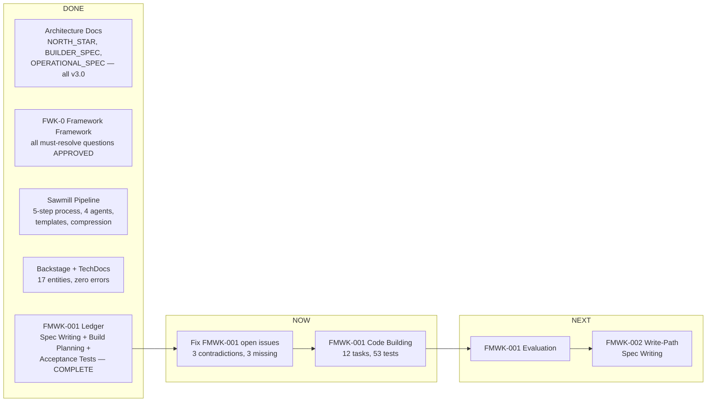
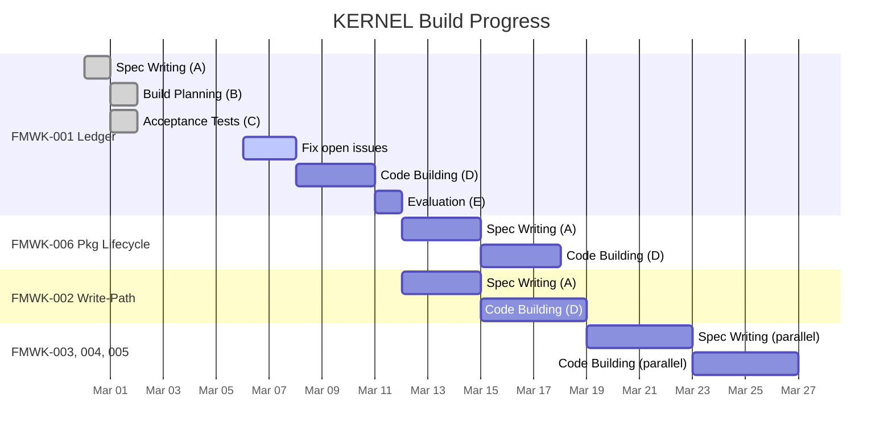

# Where We Are and What's Next

**Last updated:** 2026-03-06

---

## Current State

---

## What's Happening Right Now

| Item | Status | Detail |
|------|--------|--------|
| FMWK-001 Ledger open issues | **Blocking Code Building** | 3 contradictions between specs and live SDK, 3 missing test cases. Must fix before builder starts. See [FMWK-001 details](sawmill/FMWK-001-ledger.md#gaps-questions-and-concerns). |
| Sawmill Turn D hardening | **Done** | TDD_AND_DEBUGGING.md, verification discipline, mid-build checkpoint, self-reflection — all added to builder handoff standard. |
| Backstage TechDocs | **Done** | All framework pages live, Mermaid diagrams rendering, nav restructured. |

---

## What's Next (in order)

| Step | What happens | Blocked by |
|------|-------------|-----------|
| 1. Fix FMWK-001 open issues | Resolve 3 spec/SDK contradictions, add 3 missing test specs | Nothing — can start now |
| 2. FMWK-001 Code Building (D) | Builder implements Ledger: 12 tasks, 53 tests, staging only | Step 1 |
| 3. FMWK-001 Evaluation (E) | Evaluator runs holdout scenarios against built code | Step 2 |
| 4. FMWK-002 Spec Writing (A) | Spec agent produces D1-D6 for Write-Path | Step 3 (needs working Ledger) |
| 5. FMWK-002 Build Planning (B) + Acceptance Tests (C) | Plan agent + holdout agent run in parallel | Step 4 |
| 6. FMWK-002 Code Building (D) | Builder implements Write-Path | Step 5 |
| 7. FMWK-003, 004, 005 Spec Writing | Can start in parallel after FMWK-002 passes evaluation | Step 6 |
| 8. FMWK-006 Spec Writing | Can start after FMWK-001 passes (parallel with FMWK-002) | Step 3 |

---

## Open Gaps, Questions, and Concerns

Everything unresolved across the entire project. If it's not here, it's either resolved or not yet discovered.

### Blockers (must fix before proceeding)

| ID | Area | Issue | Impact | Owner |
|----|------|-------|--------|-------|
| B-001 | FMWK-001 | `PlatformConfig` has no immudb host/port/database fields | Spec says `LedgerConfig.from_env()` reads env vars directly — contradiction with config.py | Spec fix needed |
| B-002 | FMWK-001 | Live SDK has `data.py` not `data/` package | Staging creates `data/` independently — spec must document this clearly | Spec fix needed |
| B-003 | FMWK-001 | Live SDK `ledger.py#L190` calls `createDatabaseV2` | Spec says NEVER — builder must NOT follow live SDK pattern | Builder must know |
| B-004 | FMWK-001 | IN-002 edge case (read out of range) — no explicit test | Test spec missing for reading beyond tip | Spec fix needed |
| B-005 | FMWK-001 | IN-005 error (verify_chain when immudb down) — unspecified | Behavior undefined when immudb drops mid-verification | Spec fix needed |
| B-006 | FMWK-001 | IN-006 error (get_tip when immudb down) — unspecified | Behavior undefined when immudb drops during get_tip | Spec fix needed |

### Design Questions (need answers before future frameworks)

| ID | Area | Question | Affects | Status |
|----|------|----------|---------|--------|
| Q-001 | FMWK-002 | How exactly does fold logic work? Events become Graph state — but what's the transformation? | Write-Path is the highest risk framework | Needs Spec Writing |
| Q-002 | FMWK-002 | What happens when fold fails after Ledger append succeeds? Rollback? Retry? Hard-stop? | Data consistency guarantee | Needs Spec Writing |
| Q-003 | FMWK-002 | What is the snapshot format? FMWK-001 deferred this (GAP-2). | Graph recovery, cold start performance | FMWK-005 must define |
| Q-004 | FMWK-003 | How does aperture determination work? Architecture says "learned prior from regime/mode methylation + current evidence" but no formula. | Work order count and query scope per turn | Needs Spec Writing |
| Q-005 | FMWK-003 | What exactly is the work order state machine? Lifecycle says planned→dispatched→executing→completed/failed but transitions not specified. | Every work order in the system | Needs Spec Writing |
| Q-006 | FMWK-004 | How are prompt contracts versioned and updated? | Contract evolution, backward compatibility | Needs Spec Writing |
| Q-007 | FMWK-004 | How does LLM routing policy work? Architecture says "mechanical: HO2 reads policy, matches work order type to provider" but format unspecified. | Which models handle which tasks | Needs Spec Writing |
| Q-008 | FMWK-005 | What is the Graph query interface? Architecture says "scoring/retrieval queries" but no API defined. | Every component that reads from the Graph | Needs Spec Writing |
| Q-009 | FMWK-005 | What triggers snapshot vs. replay? Architecture says "session boundaries" but edge cases unclear. | Graph recovery reliability | Needs Spec Writing |
| Q-010 | FMWK-006 | What are the exact gate definitions? FWK-0 defines the concept but concrete gates need specifying. | Every framework install | Needs Spec Writing |
| Q-011 | FMWK-006 | How does composition registry work? Multiple frameworks, dependency ordering, conflict detection. | System-wide package management | Needs Spec Writing |

### Architectural Concerns (things that could go wrong)

| ID | Concern | Why it matters | Mitigation |
|----|---------|---------------|-----------|
| C-001 | FMWK-002 is critical path bottleneck | Everything downstream blocks on it. BUILD-PLAN marks it HIGHEST RISK. | Write the spec pack with extreme precision. Include concrete fold examples. |
| C-002 | Fold failure after Ledger append | If fold fails, Ledger has the event but Graph doesn't reflect it. System is inconsistent. | Must be resolved in FMWK-002 spec. Options: retry fold, crash and replay, or compensating event. |
| C-003 | Graph snapshot format cross-dependency | FMWK-001 deferred snapshot format to FMWK-005, but FMWK-002 needs to write snapshots. Three-way dependency. | Resolve during FMWK-002 + FMWK-005 spec writing. May need shared decision. |
| C-004 | Signal accumulator precision | Methylation values (0.0-1.0) are stored as strings to avoid float cross-language drift. But computation uses real arithmetic. | String storage is decided (CLR-003). Computation precision needs FMWK-002 spec. |
| C-005 | Single-writer assumption | FMWK-001 uses in-process mutex. If future multi-writer scenarios arise, migration path needed. | FMWK-001 CLR-001 documents this. Migration path: immudb ExecAll. |
| C-006 | Agent drift during building | Third rebuild. Previous agents over-indexed on governance and lost the product. | TDD_AND_DEBUGGING.md, 13Q gate, holdout isolation all combat this. Monitor. |

### Deferred Items (known, parked intentionally)

| ID | Item | Deferred to | Why |
|----|------|------------|-----|
| DEF-001 | Payload schema validation for 10 event types | Owning frameworks | Each framework defines its own payload schemas |
| DEF-002 | Paginated range read | Post-KERNEL | Not needed at KERNEL scale |
| DEF-003 | Zitadel OIDC integration | Post-KERNEL | API keys sufficient for local dev |
| DEF-004 | External LLM routing (beyond Ollama) | Post-KERNEL | Ollama local sufficient for demo |
| DEF-005 | Storage Management trimming | FMWK-012 (Layer 1) | Disk won't fill during KERNEL phase |
| DEF-006 | Promptfoo for automated evaluation | Layer 2 hardening | After FMWK-001 validates Layer 1 approach |
| DEF-007 | DeepEval for RESULTS.md verification | Layer 2 hardening | After FMWK-001 validates Layer 1 approach |
| DEF-008 | LangGraph self-correction loops | Layer 3 hardening | After Layer 2 infrastructure proves out |

---

## Timeline View

---

## Decision Log

Decisions made during this build that affect future work.

| Date | Decision | Rationale | Affects |
|------|----------|-----------|---------|
| 2026-02-28 | 6 KERNEL frameworks, IDs 001-006 | Decomposition standard: each framework has single capability | All builds |
| 2026-02-28 | All 7 FWK-0 must-resolve questions APPROVED | Cleared path for FMWK-001 spec writing | All builds |
| 2026-03-01 | FMWK-001 atomicity: in-process mutex (CLR-001) | Single-writer sufficient; migration to ExecAll if needed | FMWK-001, FMWK-002 |
| 2026-03-01 | All decimal values stored as strings (CLR-003) | Cross-language hash verification requires deterministic serialization | All frameworks |
| 2026-03-01 | Ledger trusts all callers (GAP-3) | Authorization via Docker network boundary, not code | FMWK-001, future multi-tenant |
| 2026-03-06 | Builder agent uses sonnet, evaluator uses opus | Fast coding vs deep reasoning about correctness | All builds |
| 2026-03-06 | TDD iron law + debugging protocol added | Sawmill gap analysis found builder discipline gaps | All builds |
